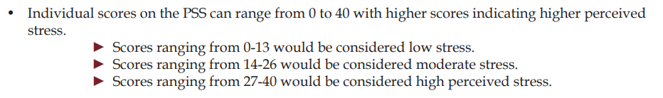
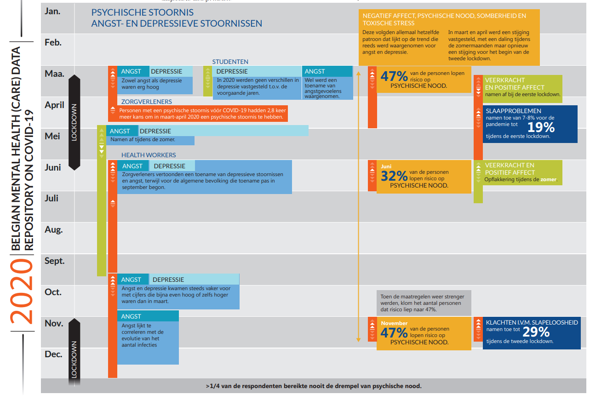
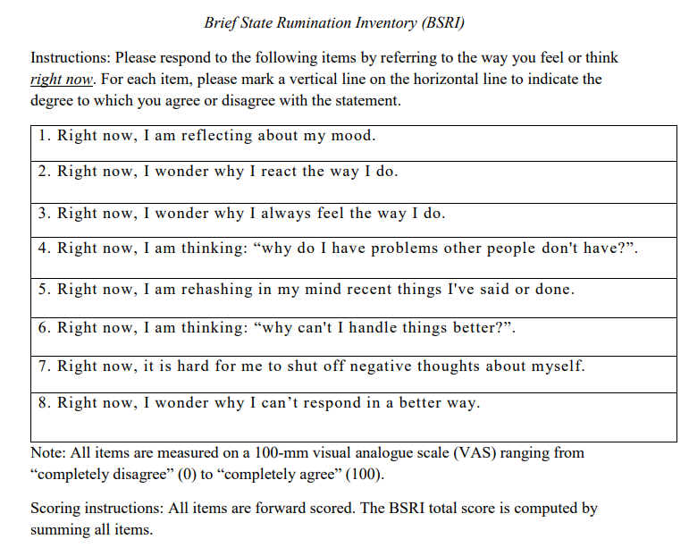
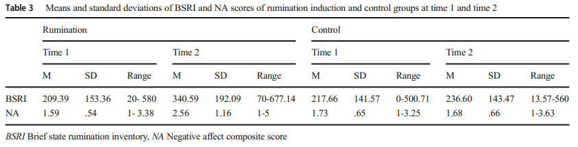
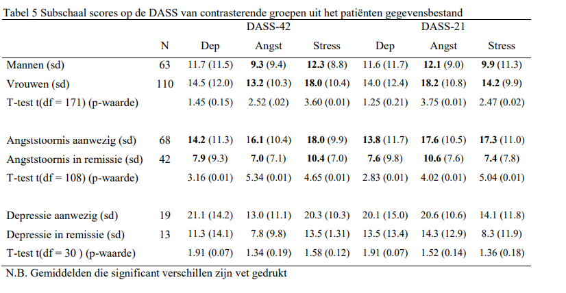

<style type="text/css">
.main-container {
  max-width: 1800px;
  margin-left: auto;
  margin-right: auto;
}
</style>
```{r setup, include=FALSE}
knitr::opts_chunk$set(dev = "png",
                      fig.path='Z:\\shares\\ghepmk_data\\2020_Kappen_PMS\\figures\\',
                      dpi = 300,
                      cache = FALSE)
```
# A Data Analysis Report {.tabset}

```{r libraries, include = FALSE}
#### Settings & Packages #### -----------------------------------------------------
rm(list = ls())
#install packages
list.of.packages <- c("lme4",'lmerTest','effects','dplyr', 'car', 'Rmisc', 'emmeans','fitdistrplus','ggplot2', 'ggstatsplot','ggsignif', 'ggformula','ggdist','ggpubr','ggeffects', 'gplots', 'gridExtra','tidyverse','pander','stringr','cowplot','lavaan','readr','jpeg','shiny','reshape2', 'yarrr','knitr', 'remotes', 'raincloudplots')
new.packages <- list.of.packages[!(list.of.packages %in% installed.packages()[,"Package"])]
if(length(new.packages)) install.packages(new.packages)

library(Rmisc)
library(raincloudplots)
library(lme4)
library(lmerTest)
library(effects)
library(dplyr)
library(car)
library(emmeans)
library(fitdistrplus)
library(gplots)
library(ggplot2)
library(ggstatsplot)
library(ggsignif)
library(ggformula)
library(ggdist)
library(ggpubr)
library(ggeffects)
library(gridExtra)
library(tidyverse)
library(pander)
library(stringr)
library(cowplot)
library(lavaan)
library(readr)
library(jpeg)
library(shiny)
library(reshape2)
library (yarrr)
library(knitr)
library(remotes)
recode <- dplyr::recode
count <- dplyr::count 

# create folder to save figures
if (!dir.exists("figures")) dir.create("figures")
# General settings
nAGQ = 0 # When writing code, set to 0, when getting final results, set to 1ù
vpn = 1 # Set to 1 if using VPN
```

Mitchel Kappen, Tilia Linthout, Liese Opsomer, Sofie Raeymakers, Steven Weyers, prof. Marie-Anne Vanderhasselt

ISALA

https://isala.be/

(gheplab icoon)

https://www.gheplab.ugent.be/projects/menstrual-cycle-info/

***


```{r load-data, echo=FALSE}
#### IMPORT data & INSPECTION #### -------------------------------------------------------------
#data directly from VPN folder
# work_dir<-"Z:\\shares\\ghepmk_data\\2020_Kappen_PMS\\RMarkdown\\Data\\"
# setwd(work_dir)
#setwd(dirname(rstudioapi::getActiveDocumentContext()$path))
if (vpn == 1){Dir = "Z:\\shares\\ghepmk_data\\2020_Kappen_PMS\\" #data from VPN folder
} else {Dir="Z:\\shares\\ghepmk_data\\2020_Kappen_PMS\\" #data from github dir
}

setwd(Dir)
# data <- read.csv(paste0(Dir,"allPMSData.csv"), header=TRUE, sep=)
data <- read.csv(paste0(Dir,"06102021\\allPMSData.csv"), header=TRUE, sep=) #upload data
norms <-read.table(paste0(Dir,"\\RMarkdown\\Data\\FemaleSubjects_1-20.txt"), header=TRUE, fill=TRUE) #upload norms IAPs images

#put 'NA' into empty spaces
# data = lapply(data, function(x) {x[x == " "] <- NA})

#we make a new variable that has value 1 for the first TestMoment and 2 for the second TestMoment
#These moments were counterbalanced. when the order was B-A and the moment is B, this means it is the first test moment, and vice versa for A-B and moment A. 
data$TestMoment[data$Order == "A-B" & data$Moment == "A"] = 1# TestMoment 1 == Follicular phase
data$TestMoment[data$Order == "B-A" & data$Moment == "A"] = 2# TestMoment 2 == Luteal phase
data$TestMoment[data$Order == "A-B" & data$Moment == "B"] = 2
data$TestMoment[data$Order == "B-A" & data$Moment == "B"] = 1
#sum(is.na(data$TestMoment))#check if there are still values missing (NA)


# new variable PMSSCORE NEW iedereen pms 0 ook 0 iedereen die 1 OF 2 heeft wordt 1, 
data$PMS[data$PMSScore==0] = 'noPMS'
data$PMS[data$PMSScore==1] = 'PMS'
data$PMS[data$PMSScore==2] = 'PMS' #PMDD, mr niet officiële diagnose dus gewoon PMS

data$rt = data$rt/1000 #put rt in sec instead of ms

#we make factors of the independable variables
data$Subject <- factor(data$ID)
levs<-union(data$ID, data$ID)
data$newid <- factor(data$ID, levels=levs, labels=seq_along(levs)) #this code replaces the '627, 534 IDs with 1, 2, 3, )
data$PMSScore <- factor(data$PMSScore)
data$PMS <- factor(data$PMS)
data$Moment <- factor(data$TestMoment) # This removes "A and B", A == 1, B == 2 now

# Exclude data?
data_allcontraception <-data
# exclude everyone on the pill/copper spiral/other: only those with Natural Contraception are left included
# data <- data[Contraception!="Pill"& Contraception!="other" & Contraception!="Cop. Coil" & Contraception!="Hor. Coil" & Contraception!='Hor.Coil']

data<-data[!(data$Contraception=="Pill"|data$Contraception=="other"|data$Contraception=="Cop.Coil"|data$Contraception=="Hor. Coil"|data$Contraception=="Hor.Coil"),]
# data<-subset(data, Contraception!="Pill" & Contraception!="other" & Contraception!="Cop. Coil" & Contraception!="Hor. Coil" & Contraception!='Hor.Coil', na.rm=TRUE)

data_out<-data #the data with the rt outliers
data <- subset(data, rt < 30)#Dit zijn de data waar de rt outliers uitgehaald zijn! 

datafaces<-data
datafaces<- subset(datafaces,  select= -c(PD_Mean, PD_Std, PD_Max, Exclusie))

# REMOVE CONFIDENCE UNDER 95
datafaces<-subset(data, confidence >.95, na.rm=TRUE)#only take data where confidence is bigger than 95

#remove datafaces with NA varaibles
# datafaces<-na.omit(datafaces)

datafaces$VideoValence <-datafaces$happy


#dataframe with the norms for the stimuli (IAPs images)
norms$IAPS <-round(norms$IAPS)
un<-c('1440', '1463', '1610', '1710', '1722', '1750', '2057', '2070', '2160', '2165', '2340', '2360', '2800', '3261', '4180', '4290', '4490', '4531',  '4550', '4561', '4658', '5030', '5600', '5800', '5982', '6312', '6313', '7182', '7211', '7224', '7238', '7380', '7480', '7481', '9220', '9300', '9320', '9584', '9592', '9594', '9600', '9911', '9920', '9921') # all the unique(data$Stimulus) in a list
norms<-as.data.frame(norms) # make a dataframe
norms$row_num <- seq.int(nrow(norms)) # give row numbers
#move column with names 
norms <- norms %>%
  relocate(desc, .after=row_num)
norms<-subset(norms, IAPS%in% un ) #we now have table with the norms for ONLY the stimuli used in this PMS experiment
norms<-norms[-c(4),] #we remove the second 1610 because it is double for some reason
#now we add the sd and means from these data to this dataframe
# https://stackoverflow.com/questions/21982987/mean-per-group-in-a-data-frame
# norms$valmn_pms<- mean(data$Valence)
norms<-cbind(norms, round(ddply(data, .(Stimulus), summarize,  valmn_pms=mean(Valence))[2])/10)
norms<-cbind(norms, round(ddply(data, .(Stimulus), summarize,  aromn_pms=mean(Arousal))[2])/10)
norms<-cbind(norms, round(ddply(data, .(Stimulus), summarize,  valsd_pms=sd(Valence))[2])/10)
norms<-cbind(norms, round(ddply(data, .(Stimulus), summarize,  arosd_pms=mean(Arousal))[2])/10)
#make all columns unique!
colnames(norms)<-make.unique(names(norms))
# group stimuli depending on whether they are part of group A or group B in exp
A<-unique(data$Stimulus[data$Order=='A-B' & data$Moment==1])# two groups of stimuli: A and B
B <-unique(data$Stimulus[data$Order=='B-A' & data$Moment==1])
norms$group[norms$IAPS %in% A]='A'# add this to the 'norms' dataset
norms$group[norms$IAPS %in% B]='B'
```

```{r functions, echo=FALSE, results='asis'}
  # violin function
    geom_flat_violin <- function(mapping = NULL, data = NULL, stat = "ydensity",
                                 position = "dodge", trim = TRUE, scale = "area",
                                 show.legend = NA, inherit.aes = TRUE, ...) {
      layer(data = data,mapping = mapping,stat = stat,geom = GeomFlatViolin,
            position = position,show.legend = show.legend, inherit.aes = inherit.aes,
      params = list(trim = trim,scale = scale,...))}

GeomFlatViolin <- ggproto("GeomFlatViolin", Geom,
          setup_data = function(data, params) {
            data$width <- data$width %||%
              params$width %||% (resolution(data$x, FALSE) * 0.9)
            # ymin, ymax, xmin, and xmax define the bounding rectangle for each group
            data %>%
              group_by(group) %>%
              mutate(ymin = min(y),ymax = max(y),xmin = x,xmax = x + width / 2) },
          draw_group = function(data, panel_scales, coord) {
            # Find the points for the line to go all the way around
            data <- transform(data, xminv = x,xmaxv = x + violinwidth * (xmax - x))
            # Make sure it's sorted properly to draw the outline
            newdata <- rbind(plyr::arrange(transform(data, x = xminv), y),
                             plyr::arrange(transform(data, x = xmaxv), -y))
            # Close the polygon: set first and last point the same
            # Needed for coord_polar and such
            newdata <- rbind(newdata, newdata[1,])
            ggplot2:::ggname("geom_flat_violin", GeomPolygon$draw_panel(newdata, panel_scales, coord))},
          draw_key = draw_key_polygon,
          default_aes = aes(weight = 1, colour = "grey20", fill = "white", size = 0.5,
                            alpha = NA, linetype = "solid"), required_aes = c("x", "y"))
    #standard error function
    standard_error <- function(x) sd(x)/sqrt(length(x))
    
#function for split violin
    GeomSplitViolin <- ggproto("GeomSplitViolin", GeomViolin, 
                           draw_group = function(self, data, ..., draw_quantiles = NULL) {
  data <- transform(data, xminv = x - violinwidth * (x - xmin), xmaxv = x + violinwidth * (xmax - x))
  grp <- data[1, "group"]
  newdata <- plyr::arrange(transform(data, x = if (grp %% 2 == 1) xminv else xmaxv), if (grp %% 2 == 1) y else -y)
  newdata <- rbind(newdata[1, ], newdata, newdata[nrow(newdata), ], newdata[1, ])
  newdata[c(1, nrow(newdata) - 1, nrow(newdata)), "x"] <- round(newdata[1, "x"])
  if (length(draw_quantiles) > 0 & !scales::zero_range(range(data$y))) {
    stopifnot(all(draw_quantiles >= 0), all(draw_quantiles <=
      1))
    quantiles <- ggplot2:::create_quantile_segment_frame(data, draw_quantiles)
    aesthetics <- data[rep(1, nrow(quantiles)), setdiff(names(data), c("x", "y")), drop = FALSE]
    aesthetics$alpha <- rep(1, nrow(quantiles))
    both <- cbind(quantiles, aesthetics)
    quantile_grob <- GeomPath$draw_panel(both, ...)
    ggplot2:::ggname("geom_split_violin", grid::grobTree(GeomPolygon$draw_panel(newdata, ...), quantile_grob))}
  else {ggplot2:::ggname("geom_split_violin", GeomPolygon$draw_panel(newdata, ...)) }})

geom_split_violin <- function(mapping = NULL, data = NULL, stat = "ydensity", position = "identity", ..., 
                              draw_quantiles = NULL, trim = TRUE, scale = "area", na.rm = FALSE, 
                              show.legend = NA, inherit.aes = TRUE) {
  layer(data = data, mapping = mapping, stat = stat, geom = GeomSplitViolin, 
        position = position, show.legend = show.legend, inherit.aes = inherit.aes, 
        params = list(trim = trim, scale = scale, draw_quantiles = draw_quantiles, na.rm = na.rm, ...))}
```

## Intro

This study looked into stress, rumination and emotion expression during the premenstrual phase with both healthy participants as participants who have PMS (premenstrual syndrome).

### PMS

PMS is a clinical disorder exclusive to people who menstruate. 

##### Symptoms

- mood swings, anxiety
- tiredness, sleep problems
- abdominal pain, bloating, gas, diarrhea
- tender breasts, spotty skin
- headaches
- changes in appetite and sex drive
- lower serotonin levels
- etiology & symptoms of PMS and depression have been linked

{width=40%}

{width=50%}


- 'pre-menstrual': during luteal phase, symptoms disappear 1-2 days into menstruation

#### PMDD

PMDD (Premenstrual Dysphoric Disorder) has recently been added to the DSM, this is a more severe version of PMS.

 <font size="1">1 Landén, M., & Eriksson, E. (2003). How does premenstrual dysphoric disorder relate to depression and anxiety disorders?. Depression and Anxiety, 17(3),
 122–129. https://doi.org/10.1002/da.10089.

2 Grady-Weliky, T. A. (2003). Premenstrual Dysphoric Disorder. New England Journal of Medicine, 348(5), 433–438. https://doi.org/10.1056/NEJMcp012067

3 Ussher, J. M. (2014). Premenstrual syndrome. Cambridge Handbook of Psychology, Health and Medicine, 830–832. https://doi.org/10.1017/CBO9780511543579.217 </font> 


##### Prevalence

- 75% of women experience some symptoms
- 20-30%: moderate to severe symptoms
- 5-8% PMDD levels of symptoms

***
### Hypotheses

#### PMS/ no PMS: 

#### during follicular and luteal/premenstrual phase cycle:

- higher stress/rumination? 
- emotion:
  +  **explicit:** self-report
  +  **implicit:** emotional expressions


*** 


### METHODS

#### PARTICIPANTS

- 398 recruited
- Invitation via email, execution on LimeSurvey + 24 h reminder
- Healthy, 18-45 yo
- Menstruating with regular cycle
- Exclusion: 
    + pregnant/ breastfeeding
    + hormones/ hormonal intrauterine device: (118 ppt)
    + BSRI = 0 (2 ppt)
    
=> 279 ppt

#### 3 TESTMOMENTS

- **Intake/screening:**: social demographics, menstrual cycle, contraception methods, PSST + trait questionnaires (DASS)

- **testmoment 1 + 2** (follicular & luteal/premenstrual): 
    + participants tested twice, based on cycle
    + invitation via e-mail + 24 h reminder
    + execution via LimeSurvey
    + counterbalanced across participants
    + fill in questionnaires: PSS(stress), BSRI(rumination)
    + judge pictures on valence & arousal
    + filmed through webcam: analysis of emotional expressions

#### SCREENING

{width=40%}

##### PSST

* Premenstrual Symptoms Screening Tool

* currently most reliable

{width=40%}

 <font size="1">Steiner et al., 2003b https://pubmed.ncbi.nlm.nih.gov/12920618/ </font>
 
 
 ##### GROUPS
 
 Using PSST, three groups: no PMS, PMS and 'PMDD'

* Prevalence study matched taht of general population

* PMDD can only be diagnosed by psychiatrist! 

=> 2 groups: 

    + no/mild symptoms: **noPMS**
    + medium-severe symptoms: **PMS**
    


***

### reaction times

we plot the reaction times to find the outliers and filter the data

```{r RTs, echo=FALSE}
#plot reaction times with raincloudplot
d<-melt(data.frame(rt=c(data_out$rt))) # we melt to wide format 
ggplot(d, aes(x = variable, y = value, fill=variable))+
  geom_flat_violin(position = position_nudge(x = .2, y = 0),adjust =2)+
  ylab('rt')+xlab('amount')+coord_flip()+theme_cowplot()+
  geom_point(position=position_jitter(width=.15), size=2)+
  geom_boxplot(width= .10, outlier.shape = NA)+
  theme(legend.position="none")+
  ggtitle("reaction times with outliers")

summary(data_out$rt)

print('upper 99.85% bound')
quantile (data_out$rt, 0.9985)

data_out <- subset(data_out, rt < 30)
d<-melt(data.frame(rt=c(data_out$rt)))
ggplot(d, aes(x = variable, y = value, fill=variable))+
  geom_flat_violin(position = position_nudge(x = .2, y = 0),adjust =2)+
  geom_point(position=position_jitter(width=.15), size=0.25)+
  ylab('rt')+xlab('amount')+coord_flip()+theme_cowplot()+
  geom_boxplot(width= .10, outlier.shape = NA)+
  theme(legend.position="none")+
  guides(fill=FALSE)+
  ggtitle("reaction times < 30 sec")

summary(data_out$rt)

out<-boxplot.stats(data_out$rt)$out#outliers
out_ind<-which(data_out$rt %in% c(out))#row numbers that contain outliers
boxplot(data_out$rt, ylab='rt') #boxplot
mtext(paste('boxplot with outliers')) #boxplot with outliers
```


***

## PSS and BSRI

### PSS: Perceived Stress Scale 

{width=40%}

### BSRI: Brief State Rumination Index

{width=40%}

measured at two time points

#### PSS and BSRI 
- PMS vs no PMS
- follicular and premenstrual/luteal phase

we first fitted several GLM (Generalized Linear Mixed) models with PSS/ BSRI as dependent variable and PMS(2 levels) x TestMoment (2 levels) and took the one with the lowest AIC (Akaike Information Criterion)

Then we did Anova chisq and contrasts of means. 

Boxplots contain the medians, circles represent the means

N= 279!

```{r PSS&BSRI, echo=FALSE, cache=FALSE}
ui<- fluidPage( # makes the User Interface
    selectInput("formula_choice", label="Choose a Formula:",
            choices= c('PSS ~ PMS', 'BSRI ~ PMS', 'PSS~ PMS*TestMoment', 'BSRI ~PMS*TestMoment'),
            selected='PSS ~ TestMoment'), # puts the choices in the first element which is accessed via input$formula_choice
     tabsetPanel(type = "tab",
                 tabPanel("overlap", plotOutput("overlap")),
                 tabPanel("splitviolin", plotOutput("splitviolin")),
                 tabPanel("pirateplot", plotOutput("pirateplot")),
                 tabPanel("TestMoment_variance", plotOutput("raincloud2")),
                 tabPanel("AIC table", tableOutput("table")),
                 tabPanel("Anova", verbatimTextOutput("Anova")),
                 tabPanel("emmeans",verbatimTextOutput("emmeans"))
         ))

server <- function (input, output){ 
  
  output$pirateplot<- renderPlot({ 
    par(mfcol = c(1, 1))
      pirateplot(
      formula= input$formula_choice,
      data=data,
      theme= 3,
      pal= "google",
      bean.f.o=0.5,
      main= 'PSS~ PMS*TestMoment',
      xlab=" TestMoment" )
    }, height= 800)
  
  p<-reactive({
        tabel<-c()
    for (i in 1:length(models())){
        AIC<- AIC(models()[[i]])
        tabel <- c(tabel,round(AIC))}
    chosenModel<-models()[which(tabel == min(tabel))]
       Anova_1 <- Anova(chosenModel[[1]])
       cat(sprintf("\nAnova\n"))
       Anova_1 })
  
  p_pms <-reactive({
    p<-(p()[[3]][1]) # this gets the p-value of the first row, for PMS
    if (p> 0.05) {star=''
    }else if (p<0.0005){'***'
    }else if (p<0.005){'**'
    }else if (p<0.05) {'*'}})

  #https://wellcomeopenresearch.org/articles/4-63   some info on rainclouds
      # https://www.rpubs.com/jenrichmond/W6LL  here some info on the following plot
    output$raincloud2 <- renderPlot({
      #function for weighted average
      x1 <- c(2, 4, 7)
      weighted_mean <- 0
      for (i in 1:length(x1)){
       weighted_mean <- (x1[i]+ x1[i+1] + x1[i+2])/3
       print (weighted_mean)}
      
      if ((grepl("PSS", input$formula_choice))){
          #dataframe for connected rainclouds
        dataf<- data[sample(nrow(data),100),]
        head(dataf)
        # we create a dataframe with only PMSScoreNew and PSS
        require(reshape2)
        dataf<- melt(dataf, id=c("TestMoment", "PSS")) #takes out these 2 variables
        head(dataf)
        #sort by TestMoment ascending (so moment 2 is last)
        dataf <- dataf[order(dataf$TestMoment),]
        head(dataf)
        tail(dataf)
        df <-data_1x1(
          array_1= dataf$PSS[1:length(dataf$PSS)/2],
          array_2=dataf$PSS[(length(dataf$PSS)/2)+1:length(dataf$PSS)],
          jit_distance=0.09,jit_seed=321)
       raincloud_1x1_repmes(
          data= df,
          colors= (c('#00CCCC', '#FF9999')),
          fills= (c('#00CCCC', '#FF9999')),
          line_color="gray",
           line_alpha=.2,
          size=1,
          alpha= .5)+
          scale_x_continuous (breaks=c(1,2), labels=c("follicular", "premenstrual"), limits=c(0,3))+
          xlab("TestMoment")+
          ylab("PSS")+
          theme_classic()+
          ggtitle("distribution PSS in follicular vs premenstrual")
      } else if ((grepl("BSRI", input$formula_choice))){
        dataf<- data[sample(nrow(data),100),]
        dataf<- melt(dataf, id=c("TestMoment", "BSRI"))
        dataf <- dataf[order(dataf$TestMoment),]
        df <-data_1x1(
          array_1= dataf$BSRI[1:length(dataf$BSRI)/2],
          array_2=dataf$BSRI[(length(dataf$BSRI)/2)+1:length(dataf$BSRI)],
          jit_distance=0.09, jit_seed=321)
        raincloud_1x1_repmes(
          data= df,
          colors= (c('#00CCCC', '#FF9999')),
          fills= (c('#00CCCC', '#FF9999')),
          line_color="gray",
          line_alpha=.2,
          size=1,
          alpha= .5)+
          scale_x_continuous (breaks=c(1,2), labels=c("follicular", "premenstrual"), limits=c(0,3))+
          xlab("TestMoment")+
          ylab("BSRI")+
          theme_classic()+
          ggtitle("distribution PSS in follicular vs premenstrual")
      }
    }, height=900)

  
    output$splitviolin <-renderPlot({
      if ((grepl("PSS", input$formula_choice)==TRUE)&!(grepl("TestMoment", input$formula_choice))){
        max_y<-max(as.integer(data$PSS))
        dmean<-summarySE(data, measurevar="PSS", groupvars=c('PMS'))
        ggplot(data, aes(x=1, y=PSS, fill=PMS))+
            geom_split_violin(adjust =1.5, alpha=.5, colour= NA)+
            geom_boxplot(aes(x = 1, y = PSS, fill = PMS), position= position_dodge(0.2),outlier.shape= NA, alpha = .5, width = .1, colour = "black")+
            geom_point(data = dmean, aes(x = 1, y = PSS, group = PMS, fill = PMS), position= position_dodge(0.2), shape = 21, size=4)+
            annotate('text', x=1, y=max_y+(max_y/10)+(max_y/100), label=sprintf("\n%s\n", p_pms()), size=10)+
           # annotate('text', x=1, y=max_y+(max_y/10)+(max_y/100), label='3', size=10)+
            geom_segment(aes(x = 0.955, y = (max_y+(max_y/10)-(max_y/80)), xend = 1.055, yend = (max_y+(max_y/10)-(max_y/80))), size= 2)+
            ggtitle('PSS ~ PMS')
      }else if (grepl('PSS', input$formula_choice)&(grepl("TestMoment", input$formula_choice))){
        max_y<- max(as.integer(data$PSS))
        dmean<-summarySE(data, measurevar="PSS", groupvars=c('PMS', 'Moment'))
        ggplot(data, aes(x=Moment, y=PSS, fill=PMS))+
            geom_split_violin(adjust =1.5, alpha=.5, colour= NA)+
            geom_boxplot(aes(x = Moment, y = PSS, fill = PMS), position= position_dodge(0.2),outlier.shape= NA, alpha = .5, width = .1, colour = "black")+
            geom_point(data = dmean, aes(x = as.numeric(Moment), y = PSS, group = PMS, fill = PMS), position= position_dodge(0.2), shape = 21, size=4)+
          scale_x_discrete(labels=c('1'='follicular', '2'='premenstrual'))+
            annotate('text', x=1, y=max_y+(max_y/10)+(max_y/100), label='***', size=8)+
            annotate('text', x=2, y=max_y+(max_y/10)+(max_y/100), label='***', size=8)+
            geom_segment(aes(x = 0.955, y = (max_y+(max_y/10)-(max_y/80)), xend = 1.055, yend = (max_y+(max_y/10)-(max_y/80))), size= 2)+
            geom_segment(aes(x = 1.955, y = (max_y+(max_y/10)-(max_y/80)), xend = 2.055, yend = (max_y+(max_y/10)-(max_y/80))), size= 2)+
          geom_segment(aes(x = 1.05, y = (max_y+(max_y/10)-(max_y/15)), xend = 2.05, yend = (max_y+(max_y/10)-(max_y/15))), size= 2)+
          annotate('text', x=1.5, y=(max_y+(max_y/10)-(max_y/20)), label='***', size=8)+
            ggtitle('PSS ~ PMS * TestMoment')
    } else if (grepl('BSRI', input$formula_choice)&(grepl("TestMoment", input$formula_choice))){
      max_y<-max(as.integer(data$BSRI))
    dmean<-summarySE(data, measurevar="BSRI", groupvars=c('PMS', 'Moment'))
      ggplot(data, aes(x=Moment, y=BSRI, fill=PMS))+
        geom_split_violin(adjust =1.5, alpha=.5, colour= NA)+
        geom_boxplot(aes(x = Moment, y = BSRI, fill = PMS), position= position_dodge(0.2),outlier.shape= NA, alpha = .5, width = .1, colour = "black")+
        geom_point(data = dmean, aes(x = as.numeric(Moment), y = BSRI, group = PMS, fill = PMS), position= position_dodge(0.2), shape = 21, size=4)+
      scale_x_discrete(labels=c('1'='follicular', '2'='premenstrual'))+
        annotate('text', x=1, y=max_y+(max_y/10)+(max_y/100), label='**', size=8)+
        annotate('text', x=2, y=max_y+(max_y/10)+(max_y/100), label='***', size=8)+
        geom_segment(aes(x = 0.955, y = (max_y+(max_y/10)-(max_y/80)), xend = 1.055, yend = (max_y+(max_y/10)-(max_y/80))), size= 2)+
        geom_segment(aes(x = 1.955, y = (max_y+(max_y/10)-(max_y/80)), xend = 2.055, yend = (max_y+(max_y/10)-(max_y/80))), size= 2)+
          geom_segment(aes(x = 1.05, y = (max_y+(max_y/10)-(max_y/15)), xend = 2.05, yend = (max_y+(max_y/10)-(max_y/15))), size= 2)+
          annotate('text', x=1.5, y=(max_y+(max_y/10)-(max_y/20)), label='***', size=8)+
        ggtitle('BSRI ~ PMS * TestMoment')
    } else {
      max_y<-max(as.integer(data$BSRI))
      dmean<-summarySE(data, measurevar="BSRI", groupvars=c('PMS'))
      ggplot(data, aes(x=1, y=BSRI, fill=PMS))+
          geom_split_violin(adjust =1.5, alpha=.5, colour= NA)+
          geom_boxplot(aes(x = 1, y = BSRI, fill = PMS), position= position_dodge(0.2),outlier.shape= NA, alpha = .5, width = .1, colour = "black")+
          geom_point(data = dmean, aes(x = 1, y = BSRI, group = PMS, fill = PMS), position= position_dodge(0.2), shape = 21, size=4)+
          annotate('text', x=1, y=max_y+(max_y/10)+(max_y/100), label=sprintf("\n%s\n", p_pms()), size=10)+
         # annotate('text', x=1, y=max_y+(max_y/10)+(max_y/100), label='3', size=10)+
          geom_segment(aes(x = 0.955, y = (max_y+(max_y/10)-(max_y/80)), xend = 1.055, yend = (max_y+(max_y/10)-(max_y/80))), size= 2)+
          ggtitle('BSRI ~ PMS')
    }
  }, height=900)
    
    output$overlap <- renderPlot({
      if (grepl('PSS', input$formula_choice) &grepl('TestMoment', input$formula_choice)){
        max_y<-max(as.integer(data$PSS))
        dmean<-summarySE(data, measurevar="PSS", groupvars=c('PMS', 'Moment'))
        ggplot(data, aes(x=Moment, y=PSS, fill=PMS))+
            geom_flat_violin (aes(fill=PMS), position= position_nudge(x=.1, y=0), adjust=1.5, alpha= .5, colour=NA)+
            geom_boxplot(aes(x=Moment, y=PSS, fill=PMS), outlier.shape=NA, alpha=.5, width=.1, colour='black')+
            geom_point(data = dmean, aes(x = as.numeric(Moment)+.1, y = PSS, group = PMS, fill= PMS), shape = 21, size=6)+
          # geom_point(data = dmean, aes(x = as.numeric(Moment), y = PSS, fill= PMS), shape = 21, size=6)+
                annotate('text', x=1, y=max_y+(max_y/10)+(max_y/130), label='***', size=8)+
      annotate('text', x=2, y=max_y+(max_y/10)+(max_y/130), label='***', size=8)+
      geom_segment(aes(x = 0.955, y = (max_y+(max_y/10)-(max_y/80)), xend = 1.055, yend = (max_y+(max_y/10)-(max_y/80))), size= 2)+
      geom_segment(aes(x = 1.955, y = (max_y+(max_y/10)-(max_y/80)), xend = 2.055, yend = (max_y+(max_y/10)-(max_y/80))), size= 2)+
          geom_segment(aes(x = 1.04, y = (max_y+(max_y/10)-(max_y/15)), xend = 2.04, yend = (max_y+(max_y/10)-(max_y/15))), size= 2)+
          annotate('text', x=1.5, y=(max_y+(max_y/10)-(max_y/20)), label='***', size=8)+
            scale_x_discrete(labels=c('1'='follicular', '2'='premenstrual'))+
            ggtitle('PSS ~ PMS * TestMoment')
    }else if (grepl('PSS', input$formula_choice) & !grepl('TestMoment', input$formula_choice)){
      max_y<-max(as.integer(data$PSS))
            dmean<-summarySE(data, measurevar="PSS", groupvars=c('PMS'))
          ggplot(data, aes(x = PMS, y = PSS)) +
            geom_flat_violin(aes(fill=PMS),position = position_nudge(x =.2, y = -1), adjust = 1.5, alpha = .5, colour = NA)+
            geom_point(aes(colour=PMS),position=position_jitter(width=.15), size=.25)+
            geom_boxplot(aes(x = PMS, y = PSS, fill = PMS),outlier.shape= NA, width = .1, colour = "black")+
            geom_point(data = dmean, aes(x = as.numeric(PMS), y = PSS, group=PMS, fill=PMS), shape = 21, size=6)+
            geom_segment(aes(x = 1, y=max_y+(max_y/10)+(max_y/150), xend = 2, yend=max_y+(max_y/10)+(max_y/150)), size= 1.7)+
          annotate('text', x=1.5, y=max_y+(max_y/10)+(max_y/50), label=sprintf("\n%s\n", p_pms()), size=10)+
            scale_x_discrete(labels=c('1'='follicular', '2'='premenstrual'))+
            ggtitle('PSS~PMS')
    }
    else if (grepl('BSRI', input$formula_choice) & grepl('TestMoment', input$formula_choice)){
        max_y<-max(as.integer(data$BSRI))
        dmean<-summarySE(data, measurevar="BSRI", groupvars=c('PMS', 'Moment'))
        ggplot(data, aes(x=Moment, y=BSRI, fill=PMS))+
            geom_flat_violin (aes(fill=PMS), position= position_nudge(x=.1, y=0), adjust=1.5, alpha= .5, colour=NA)+
            geom_boxplot(aes(x=Moment, y=BSRI, fill=PMS), outlier.shape=NA, alpha=.5, width=.1, colour='black')+
            # geom_line(data=dmean, aes(x= as.numeric(Moment)+.1, y=BSRI, group=PMS, colour=PMS), size=1.5)+
            geom_point(data = dmean, aes(x = as.numeric(Moment)+.1, y = BSRI, group = PMS, fill= PMS), shape = 21, size=6)+
                annotate('text', x=1, y=max_y+(max_y/10)+(max_y/100), label='**', size=8)+
      annotate('text', x=2, y=max_y+(max_y/10)+(max_y/100), label='***', size=8)+
      geom_segment(aes(x = 0.955, y = (max_y+(max_y/10)-(max_y/80)), xend = 1.055, yend = (max_y+(max_y/10)-(max_y/80))), size= 2)+
      geom_segment(aes(x = 1.955, y = (max_y+(max_y/10)-(max_y/80)), xend = 2.055, yend = (max_y+(max_y/10)-(max_y/80))), size= 2)+
          
          geom_segment(aes(x = 1.04, y = (max_y+(max_y/10)-(max_y/15)), xend = 2.04, yend = (max_y+(max_y/10)-(max_y/15))), size= 2)+
          annotate('text', x=1.5, y=(max_y+(max_y/10)-(max_y/20)), label='***', size=8)+
            scale_x_discrete(labels=c('1'='follicular', '2'='premenstrual'))+
            ggtitle('BSRI ~ PMS * TestMoment')
    }else {max_y<-max(as.integer(data$BSRI))
            dmean<-summarySE(data, measurevar="BSRI", groupvars=c('PMS'))
          ggplot(data, aes(x = PMS, y = BSRI)) +
            geom_flat_violin(aes(fill=PMS),position = position_nudge(x =.2, y = -1), adjust = 1.5, alpha = .5, colour = NA)+
            geom_point(aes(colour=PMS),position=position_jitter(width=.15), size=.25)+
            geom_boxplot(aes(x = PMS, y = BSRI, fill = PMS),outlier.shape= NA, width = .1, colour = "black")+
            geom_point(data = dmean, aes(x = as.numeric(PMS), y = BSRI, fill=PMS), shape = 21, size=6)+
            geom_segment(aes(x = 1, y=max_y+(max_y/10)+(max_y/150), xend = 2, yend=max_y+(max_y/10)+(max_y/150)), size= 1.7)+
          annotate('text', x=1.5, y=max_y+(max_y/10)+(max_y/60), label=sprintf("\n%s\n", p_pms()), size=10)+
            scale_x_discrete(labels=c('1'='follicular', '2'='premenstrual'))+
            ggtitle('BSRI~PMS')
        }
    }, height=900)
      
     models <- reactive({ # we need to create this within a reactive context to be able to access the formula_choice
        m <- c()
        Formula <- paste0(input$formula_choice, '+ (1|Subject)')
        # Formula <- PSS ~ PMS * TestMoment+ (1|Subject)
        tryCatch({ d0.1 <- lmer(Formula,data=data); # if this formula works
          m <- c(m, d1=d0.1)}, #we add this
          error=function(e){})
        tryCatch({ d0.2 <- glmer(Formula,data=data, family = gaussian(link = "inverse"),glmerfollicular(optimizer= "bobyqa", optCtrl = list(maxfun = 100000)),nAGQ=nAGQ); 
          m <- c(m, d1=d0.2)}, error=function(e){})
        tryCatch({ d0.3 <- glmer(Formula,data=data, family = gaussian(link = "log"),glmerfollicular(optimizer= "bobyqa", optCtrl = list(maxfun = 100000)),nAGQ=nAGQ); 
          m <- c(m, d3=d0.3)}, error=function(e){})
        tryCatch({ d0.4 <- glmer(Formula,data=data, family = Gamma(link = "identity"),glmerfollicular(optimizer= "bobyqa", optCtrl = list(maxfun = 100000)),nAGQ=nAGQ); 
          m <- c(m, d4=d0.4)}, error=function(e){})
        tryCatch({ d0.5 <- glmer(Formula,data=data, family = Gamma(link = "inverse"),glmerfollicular(optimizer= "bobyqa", optCtrl = list(maxfun = 100000)),nAGQ=nAGQ); 
          m <- c(m, d5=d0.5) }, error=function(e){})
        tryCatch({ d0.6 <- glmer(Formula,data=data, family = Gamma(link = "log"),glmerfollicular(optimizer= "bobyqa", optCtrl = list(maxfun = 100000)),nAGQ=nAGQ); 
          m <- c(m, d6=d0.6) }, error=function(e){})
        tryCatch({ d0.7 <- glmer(Formula,data=data, family = inverse.gaussian(link = "identity"),glmerfollicular(optimizer= "bobyqa", optCtrl = list(maxfun = 100000)),nAGQ=nAGQ);
          models <- c(models, d7=d0.7) }, error=function(e){})
        tryCatch({ d0.8 <- glmer(Formula,data=data, family = inverse.gaussian(link = "inverse"),glmerfollicular(optimizer= "bobyqa", optCtrl = list(maxfun = 100000)),nAGQ=nAGQ); 
          m <- c(m, d8=d0.8) }, error=function(e){})
        tryCatch({ d0.9 <- glmer(Formula,data=data, family = inverse.gaussian(link = "log"),glmerfollicular(optimizer= "bobyqa", optCtrl = list(maxfun = 100000)),nAGQ=nAGQ); 
          m <- c(m, d9=d0.9) }, error=function(e){})
        m
     })
     
 output$table <-renderTable({
  modelNames<-c()
  tabel<-c()
  chosenModel<-c()
  for (i in 1:length(models())){
    modelNames<-c(modelNames, names(models()[i]))
    AIC<-AIC(models()[[i]])
    tabel <- c (tabel, AIC)}
    chosenModel = modelNames[which(tabel == min(tabel))]
    tabel <- data.frame(Models=c('chosen  Model:', modelNames), AIC= c(chosenModel, round(tabel)))
    tabel
})
  
  output$Anova <- renderPrint({
       cat(sprintf("\nAnova\n"))
       p()})

  em <- reactive({
    tabel<-c()
    for (i in 1:length(models())){
      AIC<- AIC(models()[[i]])
      tabel <- c(tabel,round(AIC))}
    chosenModel<-models()[which(tabel == min(tabel))]
    cat(sprintf("\nemmeans of formula: %s\n", input$formula_choice))
    if ((grepl("TestMoment", input$formula_choice)==FALSE)){
      emmeans(chosenModel[[1]], pairwise ~ PMS, adjust ="fdr", type="response")
    }else{emmeans(chosenModel[[1]], pairwise ~ PMS*TestMoment, adjust ="fdr", type="response")}
  })
  
  output$emmeans <- renderPrint({em()})

}
shinyApp(ui=ui, server=server, options=list(height=1200, width=1200))
```

 
### conclusions

* PSS
  + when we look at PSS we can see sign effect (with alpha= 0.05) of PMS, even when we control for TestMoment.
  + we also have a significant difference between PMS in the follicular and the premenstrual/luteal phase, with the premenstrual phase having a higher level of PSS.
  + this effect is not found for the noPMS group. 
 
* BSRI
  + same
 
=> we can conclude that participants with PMS have more stress and ruminate more.

***

### PSS interpretation

#### Norm Groups PSS (young) women

Women have on average higher stress scales. 

**Perceived Stress Scale Sheldon Cohen** 

| |**mean**|**SD**|
|:-|:-|:-|
|  **Women:**|13.7|6.6|
| **Men:** |12.1|5.9|
| **18-29**|14.2|6.2
| **30-44**  |13|6.2|
| **45-54**  |12.6|6.1|

13.7 is average for women. 

Scores of 20/ higher are considered high stress. 

We can see that with our noPMS group, the average is around 15, where the average for the PMS group is around 18. This is higher than the typical average, but considering this study was conducted in the middle of a worldwide pandemic, this might make more sense. We will conduct additional analyses to see what the effect of time was. March-may and nov-dec especially contrasted to the rest of the time (lockdown vs no lockdown)

https://www.frontiersin.org/files/Articles/558691/fpsyt-11-558691-HTML/image_m/fpsyt-11-558691-t003.jpg

mean score of the population; 18.10 (moderate stress level)

https://www.dovepress.com/cr_data/article_fulltext/s317000/317059/img/PRBM_A_317059_t0002.jpg

PSS during pandemic:D
https://www.ncbi.nlm.nih.gov/pmc/articles/PMC7680058/


{width=30%}
{width=80%}


### BSRI norms: 

{width=40%}
{width=50%}

Our BSRI scores were also higher than during non-covid times.


## IAPs Images

### IAPs images

Now, let's look at the images the participants had to judge (while webcam records expressions). 

These were images from the IAPs dataset which is already been thoroughly tested and normed. 

*  two image groups (A and B), counterbalanced across TestMoment
  + e.g. during Moment 1 a puppy + a scary image, during moment 2 a different puppy, different scary image.
  + some participants got imagegroup A on first TestMoment, others got B. 
  
{width=50%}


**trial:**
- fixation cross, 3,000 ms
- picture for 6,000 ms
- continuous Valence and Arousal Scales

{width=50%}

 <font size="1">Linthout, T. (2021). Emotion regulation during different phases of menstual cycle in healthy women and women with premenstrual suffering.
 </font>

these already have the rt data filtered under 30 sec (outliers removed)

We looked at the images and at participants who were outliers, e.g. who rated an image negatively when everyone else rated the image positively to see if there were any trends. We removed one participant who always rated 0 or 100. 

- weird answers? outliers? trends? 
- looking for the unexpected e.g. people who hate kittens. 

the numbers are those of the IAPs index. 

```{r Stimuli, echo=FALSE}
# unique<-sort(unique(data$Stimulus), decreasing=FALSE) #find all the stimuli
# we maken een density plotvoor zowel valence als arousal voor elke stimulus (2x22)
ui<- fluidPage( 
    radioButtons("stimulus", label="Choose a Stimulus:",
            choices= c('1440', '1463', '1610', '1710', '1722', '1750', '2057', '2070', '2160', '2165', '2340', '2360', '2800', '3261', '4180', '4290', '4490', '4531',  '4550', '4561', '4658', '5030', '5600', '5800', '5982', '6312', '6313', '7182', '7211', '7224', '7238', '7380', '7480', '7481', '9220', '9300', '9320', '9584', '9592', '9594', '9600', '9911', '9920', '9921'), inline=TRUE,
            selected='1440'),
    tabsetPanel(type = "tab",
      tabPanel("densityplot", plotOutput("densityplot")),
      tabPanel("IAPs_Image", plotOutput("IAPs_Image"))
    )
)

server <- function (input, output){ 
  #we make a density plot of valence/arousal per stimulus.
  output$densityplot<- renderPlot({
    d<-melt(data.frame(valence=c(data$Valence[data$Stimulus==input$stimulus]),arousal=c(data$Arousal[data$Stimulus==input$stimulus]), order=c(data$Order[data$Stimulus==input$stimulus])))
    d2<-data.frame(valence=c(data$Valence[data$Stimulus==input$stimulus]), ID=c(data$newid[data$Stimulus==input$stimulus])) 
    min<-d2$ID[which(d2$valence==min(d2$valence))]#ids of min valence
    max<-d2$ID[which(d2$valence==max(d2$valence))]#ids of max valence
    if (length(min)<length(max)){text=min } else {text=max}
    
    pirateplot(
      formula=value~variable,
      data=d,
      main= input$stimulus, pal='xmen',
      xlab= str_glue('outlier: {text}'))
  }, height=700, width= 1000)
  
  output$IAPs_Image <- renderImage({
    list(src=str_glue("Z:/shares/ghep_lab/ImageDatabases/IAPS/{input$stimulus}.jpg"),
         filetype="image/jpeg",width=800,height=600)})}

shinyApp(ui=ui, server=server, options= list(height=1000))
```

#### outliers: 

arabic numbers indicate newIDs, roman numbers the amount of times they had the most extreme answer.

Because these are 'extreme' participants, we looked into them a bit further to look for any trends. 

* 25: VI: negative reaction to nakedness/sex: 4180, 4290, 4490, 4550, 4561,4658
* 75: IV: neg react nakedness and sex (4531, 4490, 4180, 4658)
* 145: II, neg reaction nakedness (4290, 4561)
* 284: III: neg react baby (2057, 2070, 2165)

* 47: II: neg reaction to clouds (5982) and positive to a needle in an arm (9594)
* 89: II: pos reaction on trippy schilderijen (7182, 7238)
* 169: II: pos reaction on violent image (9921)
* 194: II: neg reaction mountains (5600) and pasta (194)
* 1: II: always answers 0 or 100, also on boring closet (7224), painting (7238) => got removed!

one-time outliers:    
10  27  30  31  40  74  97 100 119 121 128 134 136 167 168 206 221
233 240 244 251 252 257 259 262 293 315 334 351 365 374 376

#### Scoring of images on valence and arousal

| 'medium'= 40-60 |  |
|:----|:----------------------|
|  **high valence, high arousal:** | 4658, 4561, 4658  |
| **high valence, low arousal:** |  2360, 5030, 5600, 5800, 5982, 5030, 5800, 5982 |
| **high valence, medium arousal:** | 1440, 1463, 1610, 1710, 1722, 1750, 2057, 2070, 2160, 2165, 2340 7480, 7481, 5600, 7480, 7481 |
| **low valence, high arousal:** | 2800, 3261, 6312, 6313, 7182, 7380, 6312, 6313, 7380, 9600, 9911, 9920, 9921 |
| **low valence, low arousal:** |  9220 |
| **low valence, medium arousal:** | 9300, 9320, 9584, 9592, 9594 |
| **medium valence, high arousal:** | 7182 |
| **medium valence, low arousal:** |  7224, 7224 |
| **medium valence, medium arousal:** |  7211, 7238, 4550, 7211, 7238 |


### Effect of Order? 
```{r, echo=FALSE}
pirateplot(formula=Arousal ~ Order,
  data=data,
  pal='xmen')

pirateplot(formula=Valence ~ Order,
  data=data,
  pal='xmen')
```

As you can see, there isn't much difference depending on the order. 

### Statistics

- effects of PMS/noPMS and Testmoment on Valence and Arousal


```{r ValenceArousal, echo=FALSE}
ui<- fluidPage( 
      selectInput("formula_choice", label="Choose a Formula:",
            choices= c('Valence~PMS', 'Arousal~PMS', 'Valence~PMS * TestMoment', 'Arousal ~ PMS * TestMoment'),
            selected='Valence~PMS'),
    tabsetPanel(type = "tab",        
      tabPanel('overlap', plotOutput('overlap')),
      tabPanel('splitviolin', plotOutput('splitviolin')),
      tabPanel("pirateplot", plotOutput("pirateplot")),
      tabPanel("Testmoment_variance", plotOutput("TestMoment_Variance")),
      tabPanel("AIC table", tableOutput("table")),
      tabPanel("Anova", verbatimTextOutput("Anova")),
      tabPanel("emmeans",verbatimTextOutput("emmeans"))
    )
)

server <- function (input, output){ 
  p_pms <-reactive({
    p<-(p()[[3]][1]) # this gets the p-value of the first row, for PMS
    if (p> 0.05) {''
    }else if (p<0.0005){'***'
    }else if (p<0.005){'**'
    }else if (p<0.05) {'*'}
  })
  
  #we make a density plot of valence/arousal per stimulus.
  output$pirateplot<- renderPlot({
    pirateplot(
          formula= input$formula_choice,
          data=data,
          theme= 1,
          pal= "xmen",
          main= input$formula_choice,
        )
  }, height=600, width= 1100)
  
  output$overlap <-renderPlot({
    if (grepl('Arousal', input$formula_choice) &grepl('TestMoment', input$formula_choice)){
      dmean<-summarySE(data, measurevar="Arousal", groupvars=c('PMS', 'Moment'))
        ggplot(data, aes(x=Moment, y=Arousal, fill=PMS))+
          geom_flat_violin (aes(fill=PMS), position= position_nudge(x=.1, y=0), adjust=1.5, alpha= .5, colour=NA)+
          geom_boxplot(aes(x=Moment, y=Arousal, fill=PMS), outlier.shape=NA, alpha=.5, width=.1, colour='black')+
          geom_point(data = dmean, aes(x = as.numeric(Moment)+.1, y = Arousal, group = PMS, fill= PMS), shape = 21, size=6)+
          scale_x_discrete(labels=c('1'='follicular', '2'='premenstrual'))+
          annotate('text', x=1, y=105, label='*', size=8)+
          annotate('text', x=2, y=105, label='*', size=8)+
          geom_segment(aes(x = 0.97, y = 103, xend = 1.03, yend = 103), size= 2)+
          geom_segment(aes(x = 1.97, y = 103, xend = 2.03, yend = 103), size= 2)+
          ggtitle('Arousal ~ PMS * TestMoment')
        }else if (grepl('Valence', input$formula_choice) & grepl('TestMoment', input$formula_choice)){
      dmean<-summarySE(data, measurevar="Valence", groupvars=c('PMS', 'Moment'))
        ggplot(data, aes(x=Moment, y=Valence, fill=PMS))+
          geom_flat_violin (aes(fill=PMS), position= position_nudge(x=.1, y=0), adjust=1.5, alpha= .5, colour=NA)+
          geom_boxplot(aes(x=Moment, y=Valence, fill=PMS), outlier.shape=NA, alpha=.5, width=.1, colour='black')+
          geom_point(data = dmean, aes(x = as.numeric(Moment)+.1, y = Valence, group = PMS, fill=PMS), shape = 21, size=6)+
          scale_x_discrete(labels=c('1'='follicular', '2'='premenstrual'))+
          ggtitle('Valence~PMS * TestMoment')
    }
    else if (grepl('Arousal', input$formula_choice) & !grepl('TestMoment', input$formula_choice)){
      dmean<-summarySE(data, measurevar="Arousal", groupvars=c('PMS'))
          ggplot(data, aes(x = PMS, y = Arousal)) +
            geom_flat_violin(aes(fill=PMS),position = position_nudge(x =.2, y = -1), adjust = 1.5, alpha = .5, colour = NA)+
            geom_point(aes(colour=PMS),position=position_jitter(width=.15), size=.25)+
            geom_boxplot(aes(x = PMS, y = Arousal, fill = PMS),outlier.shape= NA, width = .1, colour = "black")+
            geom_point(data = dmean, aes(x = as.numeric(PMS), y = Arousal, fill=PMS), shape = 21, size=6)+
            geom_segment(aes(x = 1., y = 103, xend = 2., yend = 103), size= 1.7)+
          # annotate('text', x=1.6, y=105, label=sprintf("\n%s\n", p_pms()), size=10)+
            annotate('text', x=1.6, y=105, label='*', size=10)+
            scale_x_discrete(labels=c('1'='follicular', '2'='premenstrual'))+
            ggtitle('Arousal~PMS')
    }else {
      dmean<-summarySE(data, measurevar="Valence", groupvars=c('PMS'))
          ggplot(data, aes(x = PMS, y = Valence)) +
            geom_flat_violin(aes(fill=PMS),position = position_nudge(x =.2, y = -1), adjust= 1.5, alpha = .5, colour = NA)+
            geom_point(aes(colour=PMS),position=position_jitter(width=.15), size=.25)+
            geom_boxplot(aes(x = PMS, y = Valence, fill = PMS),outlier.shape= NA, width = .1, colour = "black")+
            geom_point(data = dmean, aes(x = as.numeric(PMS), y = Valence, fill=PMS), shape = 21, size=6)+
            ggtitle('Valence~PMS')
    }
  }, height=700, width=1100)
          
  # output$splitviolin <-renderPlot({
  #   if (grepl('Arousal', input$formula_choice)){
  #     max_y <- max( as.integer(data$Arousal) )
  #     dmean<-summarySE(data, measurevar='Arousal', groupvars=c('PMS', 'Moment'))
  #       ggplot(data, aes(x=Moment, y=Arousal, fill=PMS))+
  #           geom_split_violin(adjust =1.5, alpha=.5, colour= NA)+
  #         geom_boxplot(aes(x = Moment, y = Arousal, fill = PMS), position= position_dodge(0.2),outlier.shape= NA, alpha = .5, width = .1, colour = "black")+
  #         geom_point(data = dmean, aes(x = as.numeric(Moment), y = Arousal, group = PMS, fill = PMS), position= position_dodge(0.2), shape = 21, size=4)+
  #       scale_x_discrete(labels=c('1'='follicular', '2'='premenstrual'))+
  #         annotate('text', x=1, y=max_y+(max_y/10)+(max_y/100), label='*', size=8)+
  #         annotate('text', x=2, y=max_y+(max_y/10)+(max_y/100), label='*', size=8)+
  #         geom_segment(aes(x = 0.955, y=(max_y+(max_y/10)-(max_y/80)), xend = 1.055, yend = (max_y+max_y/10)-(max_y/80)), size= 2)+
  #         geom_segment(aes(x = 1.955, y=max_y+(max_y/10)-(max_y/80), xend = 2.055, yend = max_y+(max_y/10)-(max_y/80)), size= 2)+
  #         ggtitle('Arousal ~ PMS * TestMoment')
  #   } else if (grepl('Valence', input$formula_choice)){
  #     dmean<-summarySE(data, measurevar="Valence", groupvars=c('PMS', 'Moment'))
  #       ggplot(data, aes(x=Moment, y=Valence, fill=PMS))+
  #           geom_split_violin(adjust=1.5,alpha=.5, colour=NA)+
  #         geom_boxplot(aes(x = Moment, y = Valence, fill = PMS), position= position_dodge(0.2) ,outlier.shape= NA, alpha = .5, width = .1, colour = "black")+
  #         geom_point(data = dmean, aes(x = as.numeric(Moment), y = Valence, group = PMS, fill = PMS), position=position_dodge(0.2), shape = 21, size=4)+
  #         scale_x_discrete(labels=c('1'='follicular', '2'='premenstrual'))+
  #         ggtitle('Valence ~ PMS * TestMoment')
  #   }
  # }, height=600)
  
  output$splitviolin <-renderPlot({
      if ((grepl("Arousal", input$formula_choice)==TRUE)&!(grepl("TestMoment", input$formula_choice))){
        max_y<-max(as.integer(data$Arousal))
        dmean<-summarySE(data, measurevar="Arousal", groupvars=c('PMS'))
        ggplot(data, aes(x=1, y=Arousal, fill=PMS))+
            geom_split_violin(adjust =1.5, alpha=.5, colour=NA)+
            geom_boxplot(aes(x = 1, y = Arousal, fill = PMS), position= position_dodge(0.2),outlier.shape= NA, alpha = .5, width = .1, colour = "black")+
            geom_point(data = dmean, aes(x = 1, y = Arousal, group = PMS, fill = PMS), position= position_dodge(0.2), shape = 21, size=4)+
            annotate('text', x=1, y=max_y+(max_y/10)+(max_y/100), label=sprintf("\n%s\n", p_pms()), size=10)+
           # annotate('text', x=1, y=max_y+(max_y/10)+(max_y/100), label='3', size=10)+
            geom_segment(aes(x = 0.955, y = (max_y+(max_y/10)-(max_y/80)), xend = 1.055, yend = (max_y+(max_y/10)-(max_y/80))), size= 2)+
            ggtitle('Arousal ~ PMS')
      }else if (grepl('Arousal', input$formula_choice)&(grepl("TestMoment", input$formula_choice))){
        max_y <- max( as.integer(data$Arousal) )
      dmean<-summarySE(data, measurevar='Arousal', groupvars=c('PMS', 'Moment'))
        ggplot(data, aes(x=Moment, y=Arousal, fill=PMS))+
            geom_split_violin(adjust =1.5, alpha=.5, colour= NA)+
          geom_boxplot(aes(x = Moment, y = Arousal, fill = PMS), position= position_dodge(0.2),outlier.shape= NA, alpha = .5, width = .1, colour = "black")+
          geom_point(data = dmean, aes(x = as.numeric(Moment), y = Arousal, group = PMS, fill = PMS), position= position_dodge(0.2), shape = 21, size=4)+
        scale_x_discrete(labels=c('1'='follicular', '2'='premenstrual'))+
          annotate('text', x=1, y=max_y+(max_y/10)+(max_y/100), label='*', size=8)+
          annotate('text', x=2, y=max_y+(max_y/10)+(max_y/100), label='*', size=8)+
          geom_segment(aes(x = 0.955, y=(max_y+(max_y/10)-(max_y/80)), xend = 1.055, yend = (max_y+max_y/10)-(max_y/80)), size= 2)+
          geom_segment(aes(x = 1.955, y=max_y+(max_y/10)-(max_y/80), xend = 2.055, yend = max_y+(max_y/10)-(max_y/80)), size= 2)+
          ggtitle('Arousal ~ PMS * TestMoment')
    } else if (grepl('Valence', input$formula_choice)&(grepl("TestMoment", input$formula_choice))){
      dmean<-summarySE(data, measurevar="Valence", groupvars=c('PMS', 'Moment'))
        ggplot(data, aes(x=Moment, y=Valence, fill=PMS))+
            geom_split_violin(adjust=1.5,alpha=.5, colour=NA)+
          geom_boxplot(aes(x = Moment, y = Valence, fill = PMS), position= position_dodge(0.2) ,outlier.shape= NA, alpha = .5, width = .1, colour = "black")+
          geom_point(data = dmean, aes(x = as.numeric(Moment), y = Valence, group = PMS, fill = PMS), position=position_dodge(0.2), shape = 21, size=4)+
          scale_x_discrete(labels=c('1'='follicular', '2'='premenstrual'))+
          ggtitle('Valence ~ PMS * TestMoment')
    } else {
        max_y<-max(as.integer(data$Valence))
        dmean<-summarySE(data, measurevar="Valence", groupvars=c('PMS'))
        ggplot(data, aes(x=1, y=Valence, fill=PMS))+
            geom_split_violin(adjust =1.5, alpha=.5, colour=NA)+
            geom_boxplot(aes(x = 1, y = Valence, fill = PMS), position= position_dodge(0.2),outlier.shape= NA, alpha = .5, width = .1, colour = "black")+
            geom_point(data = dmean, aes(x = 1, y = Valence, group = PMS, fill = PMS), position= position_dodge(0.2), shape = 21, size=4)+
            annotate('text', x=1, y=max_y+(max_y/10)+(max_y/100), label=sprintf("\n%s\n", p_pms()), size=10)+
           # annotate('text', x=1, y=max_y+(max_y/10)+(max_y/100), label='3', size=10)+
            # geom_segment(aes(x = 0.955, y = (max_y+(max_y/10)-(max_y/80)), xend = 1.055, yend = (max_y+(max_y/10)-(max_y/80))), size= 2)+
            ggtitle('Valence ~ PMS')
    }
  }, height=700, width=1100)
  
  output$TestMoment_Variance <- renderPlot({
      #function for weighted average
      x1 <- c(2, 4, 7)
      weighted_mean <- 0
      for (i in 1:length(x1)){
       weighted_mean <- (x1[i]+ x1[i+1] + x1[i+2])/3}
      
      if ((grepl("Valence", input$formula_choice))){
        dataf<- data[sample(nrow(data),100),]
        dataf<- melt(dataf, id=c("TestMoment", "Valence")) 
        dataf <- dataf[order(dataf$TestMoment),]
        df <-data_1x1(
          array_1= dataf$Valence[1:length(dataf$Valence)/2],
          array_2=dataf$Valence[(length(dataf$Valence)/2)+1:length(dataf$Valence)],
          jit_distance=0.09,jit_seed=321)
       raincloud_1x1_repmes(
          data= df,
          colors= (c('#00CCCC', '#FF9999')),
          fills= (c('#00CCCC', '#FF9999')),
          line_color="gray",
          line_color="gray",
           line_alpha=.2,
          size=1,
          alpha= .5)+
          scale_x_continuous (breaks=c(1,2), labels=c("follicular", "premenstrual"), limits=c(0,3))+
          xlab("TestMoment")+ylab("Valence")+
          theme_classic()+
          ggtitle("distribution Valence in follicular vs premenstrual")
      } else if ((grepl("Arousal", input$formula_choice))){
        dataf<- data[sample(nrow(data),100),]
        dataf<- melt(dataf, id=c("TestMoment", "Arousal"))
        dataf <- dataf[order(dataf$TestMoment),]
        df <-data_1x1(
          array_1= dataf$Arousal[1:length(dataf$Arousal)/2],
          array_2=dataf$Arousal[(length(dataf$Arousal)/2)+1:length(dataf$Arousal)],
          jit_distance=0.09, jit_seed=321)
        raincloud_1x1_repmes(
          data= df,
          colors= (c('#00CCCC', '#FF9999')),
          fills= (c('#00CCCC', '#FF9999')),
          line_color="gray",
          line_color="gray",
          line_alpha=.2,
          size=1,
          alpha= .5)+
          scale_x_continuous (breaks=c(1,2), labels=c("follicular", "premenstrual"), limits=c(0,3))+
          xlab("TestMoment")+
          ylab("Arousal")+
          theme_classic()+
          ggtitle("distribution Arousal in follicular vs premenstrual")
      }
    }, height=800, width=1200)


  
     models <- reactive({
        m <- c()
        Formula <- paste0(input$formula_choice, '+ (1|Subject)')
        tryCatch({ d0.1 <- lmer(Formula,data=data); m <- c(m, d1=d0.1)}, error=function(e){})
        tryCatch({ d0.2 <- glmer(Formula,data=data, family = gaussian(link = "inverse"),glmerfollicular(optimizer= "bobyqa", optCtrl = list(maxfun = 100000)),nAGQ=nAGQ); m <- c(m, d1=d0.2)}, error=function(e){})
        tryCatch({ d0.3 <- glmer(Formula,data=data, family = gaussian(link = "log"),glmerfollicular(optimizer= "bobyqa", optCtrl = list(maxfun = 100000)),nAGQ=nAGQ); m <- c(m, d3=d0.3)}, error=function(e){})
        tryCatch({ d0.4 <- glmer(Formula,data=data, family = Gamma(link = "identity"),glmerfollicular(optimizer= "bobyqa", optCtrl = list(maxfun = 100000)),nAGQ=nAGQ); m <- c(m, d4=d0.4)},error=function(e){})
        tryCatch({ d0.5 <- glmer(Formula,data=data, family = Gamma(link = "inverse"),glmerfollicular(optimizer= "bobyqa", optCtrl = list(maxfun = 100000)),nAGQ=nAGQ); m <- c(m, d5=d0.5) }, error=function(e){})
        tryCatch({ d0.6 <- glmer(Formula,data=data, family = Gamma(link = "log"),glmerfollicular(optimizer= "bobyqa", optCtrl = list(maxfun = 100000)),nAGQ=nAGQ); m <- c(m, d6=d0.6) }, error=function(e){})
        tryCatch({ d0.7 <- glmer(Formula,data=data, family = inverse.gaussian(link = "identity"),glmerfollicular(optimizer= "bobyqa", optCtrl = list(maxfun = 100000)),nAGQ=nAGQ);models <- c(models, d7=d0.7) }, error=function(e){})
        tryCatch({ d0.8 <- glmer(Formula,data=data, family = inverse.gaussian(link = "inverse"),glmerfollicular(optimizer= "bobyqa", optCtrl = list(maxfun = 100000)),nAGQ=nAGQ); m <- c(m, d8=d0.8) }, 
          error=function(e){})
        tryCatch(+{ d0.9 <- glmer(Formula,data=data, family = inverse.gaussian(link = "log"),glmerfollicular(optimizer= "bobyqa", optCtrl = list(maxfun = 100000)),nAGQ=nAGQ);  m <- c(m, d9=d0.9) }, 
          error=function(e){})
        m
     })
  
  output$table <-renderTable({
    modelNames<-c()
    tabel<-c()
    for (i in 1:length(models())){
      modelNames<-c(modelNames, names(models()[i]))
      AIC<-AIC(models()[[i]])
      tabel <- c (tabel, round(AIC))}
      chosenModel = modelNames[which(tabel == min(tabel))]
      tabel <- data.frame(Models=c('chosen  Model:', modelNames), AIC= c(chosenModel, tabel))
      tabel
  })
  
  p<-reactive({
      tabel<-c()
  for (i in 1:length(models())){
      AIC<- AIC(models()[[i]])
      tabel <- c(tabel,round(AIC))}
  chosenModel<-models()[which(tabel == min(tabel))]
     cat(sprintf("\nAnova\n"))
     Anova(chosenModel[[1]])})

  output$Anova <- renderPrint({p()})
  
  em <- reactive({
    tabel<-c()
    for (i in 1:length(models())){
      AIC<- AIC(models()[[i]])
      tabel <- c(tabel,round(AIC))}
    chosenModel<-models()[which(tabel == min(tabel))]
    cat(sprintf("\nemmeans of formula: %s\n", input$formula_choice))
    if ((grepl("TestMoment", input$formula_choice)==FALSE)){
      emmeans(chosenModel[[1]], pairwise ~ PMS, adjust ="fdr", type="response")
    }else{emmeans(chosenModel[[1]], pairwise ~ PMS*TestMoment, adjust ="fdr", type="response")}
  })
  
    output$emmeans <- renderPrint({em()})
}
shinyApp(ui=ui, server=server, options= list(height=1000))
```

### Conclusions


- We found that people with PMS rated the images higher on Arousal on average, but found no significant differences for Valence. When controlling for Testmoment we got the same results. 

- no conclusions can be made for TestMoment: found no sign diff

***

### further data processing


- We took the IAPs norms for Female Subjects and made a dataframe
- the dataframe has SD and Mean for Valence/Arousal for both norms and PMS study. 

- the first plot shows the norms and PMS plotted with x=means of Valence and y= means of Arousal
- the second plot shows the ideal correlation (red line), the actual correlation (black line) and the C.I. (grey)
  + each point is where PMS and norms come together. 
  + These are positively correlated if Valence is scored similarly in the PMS study (e.g. low for image x)
  
- the last plot shows Image Group A vs B (matched images) in PMS vs norms

```{r VACorrelations, echo=FALSE}
ui<- fluidPage( 
    radioButtons("choice", label="choose",
            choices= c('Valence mean', 'Valence SD', 'Arousal mean', 'Arousal SD'), inline=TRUE,
            selected='Valence mean'), 
    tabsetPanel(type = "tab",        
      tabPanel("plot", plotOutput("plot")),
      tabPanel('correlations', plotOutput('correlations')),
      tabPanel('groups', plotOutput('groups'))
    )
)

server <- function (input, output){ 
  
  output$plot <-renderPlot({
        ggplot(norms, aes(x = valmn_pms, y = aromn_pms))+
          geom_text(aes(label=IAPS),hjust=0, vjust=0, size=3)+
          geom_point(data= norms, aes(x=valmn, y=aromn), size=2, colour='black')+
          geom_point(data= norms, aes(x=valmn_pms, y=aromn_pms), size=2, colour='red')+
          ggtitle("mean Arousal and Valence norm females")
    }, height=800)
    
# calculate correlations
    output$correlations<- renderPlot({
      # p1<- ggplot(norms$valmn, norms$valmn_pms, method=c('pearson'))
      if ((grepl("Valence", input$choice)==TRUE)&(grepl("mean", input$choice)==TRUE)){
        ggscatter(norms, x='valmn', y='valmn_pms', 
                        add='reg.line', fullrange=TRUE,
                    conf.int=TRUE,
                    cor.coef=TRUE, cor.method='pearson', 
                    xlab='norm means Valence', ylab='PMS means Valence', 
                    xlim=c(0,10))+
          geom_segment(aes(x = 0, y = 0, xend = 10, yend = 10), size= 1, colour='red')
        } else if ((grepl("Valence", input$choice)==TRUE)&(grepl("SD", input$choice)==TRUE)){
        ggscatter(norms, x='valsd', y='valsd_pms', 
                        add='reg.line', fullrange=TRUE,
                    conf.int=TRUE,
                    cor.coef=TRUE, cor.method='pearson', 
                    xlab='norm SD Valence', ylab='PMS SD Valence')+
          geom_segment(aes(x = 0, y = 0, xend = 3, yend = 3), size= 1, colour='red')
        } else if ((grepl("Arousal", input$choice)==TRUE)&(grepl("mean", input$choice)==TRUE)){
        ggscatter(norms, x='aromn', y='aromn_pms', 
                        add='reg.line', fullrange=TRUE,
                    conf.int=TRUE,
                    cor.coef=TRUE, cor.method='pearson', 
                    xlab='norm means Arousal', ylab='PMS means Arousal', 
                    xlim=c(0,10))+
          geom_segment(aes(x = 0, y = 0, xend = 10, yend = 10), size= 1, colour='red')
        }else {ggscatter(norms, x='arosd', y='arosd_pms', 
                        add='reg.line', fullrange=TRUE,
                    conf.int=TRUE,
                    cor.coef=TRUE, cor.method='pearson', 
                    xlab='norm SD Arousal', ylab='PMS SD Arousal')+
          geom_segment(aes(x = 0, y = 0, xend = 4, yend = 10), size= 1, colour='red')
        }
  }, height=800)
    
    output$groups <- renderPlot({
      if ((grepl("Valence", input$choice)==TRUE)&(grepl("mean", input$choice)==TRUE)){
                ggscatter(norms, x='valmn', y='valmn_pms', 
                      color= 'group',
                      palette=get_palette('npg', 2),
                      ellipse=TRUE, ellipse.type='convex',
                    xlab='norm means Valence', ylab='PMS means Valence', 
                    xlim=c(0,10))
    # http://www.sthda.com/english/articles/24-ggpubr-publication-ready-plots/78-perfect-scatter-plots-with-correlation-and-marginal-histograms/
      # ggpar(p, xlim=c(0,10))
      }else if ((grepl("Valence", input$choice)==TRUE)&(grepl("SD", input$choice)==TRUE)){
                      ggscatter(norms, x='valsd', y='valsd_pms', 
                      color= 'group',
                      palette=get_palette('npg', 2),
                      ellipse=TRUE, ellipse.type='convex',
                    xlab='norm SD Valence', ylab='PMS SD Valence')
        } else if ((grepl("Arousal", input$choice)==TRUE)&(grepl("mean", input$choice)==TRUE)){
                      ggscatter(norms, x='aromn', y='aromn_pms', 
                      color= 'group',
                      palette=get_palette('npg', 2),
                      ellipse=TRUE, ellipse.type='convex',
                    xlab='norm means Arousal', ylab='PMS means Arousal', 
                    xlim=c(0,10))
        } else {ggscatter(norms, x='arosd', y='arosd_pms', 
                      color= 'group',
                      palette=get_palette('npg', 2),
                      ellipse=TRUE, ellipse.type='convex',
                    xlab='norm SD Arousal', ylab='PMS SD Arousal')
        } 
    }, height=800)
}
shinyApp(ui=ui, server=server,options= list(height=1000))
```

### Conclusions

- We checked if there were differences between our study and the norms on these images in arousal and valence, and found high and significant correlations. 

- We did not find much differences between the image groups A and B. 

***

## Videos

- webcam would record participants as they judged the pictures
- with OpenFace toolbox
- decode facial expressions based on facial action units
- lelss data: only confidence >.95 + some video's excluded: bad quality(/unconvertable)

### Action Units

#### These Action units were used for the coding of the emotional expressions:


| emotion | Description  | Examples |
|:----|:----|----|
| **AU12** | Lip Corner Puller, Zygomatic Major  | {width=20%} |
| **AU15** | Lip Corner Depressor, Depressor anguli oris (Triangularis)  | {width=20%} |
|  **happy** | Cheek Raiser, Lip Corner Puller  | {width=20%} {width=20%}  |
| **sad** | Inner Brow Raiser, Brow Lowerer, Lip Corner Depressor  | {width=20%} {width=20%}{width=20%}|
| **disgust** | Nose Wrinkler, Lip Corner Depressor, Lower Lip Depressor | {width=20%}{width=20%}{width=20%} |
| **anger** | Brow Lowerer, Upper LId Raiser, Lid Tightener, Lip Tigheter | {width=20%}{width=20%}{width=20%}{width=20%} |
| **scared** |  Inner Brow Raiser, Outer Brow Raiser, Brow Lowerer, Upper Lid Raiser, Lid Tightener, Lip Stretcher, Jaw Drop | {width=20%}{width=20%}{width=20%}{width=20%}{width=20%}{width=20%}{width=20%} |

**ValenceVideo= happyness**

```{r stimulivideo, echo=FALSE}
ui<- fluidPage( 
    radioButtons("stimulus", label="Choose a Stimulus:",
            choices= c('1440', '1463', '1610', '1710', '1722', '1750', '2057', '2070', '2160', '2165', '2340', '2360', '2800', '3261', '4180', '4290', '4490', '4531',  '4550', '4561', '4658', '5030', '5600', '5800', '5982', '6312', '6313', '7182', '7211', '7224', '7238', '7380', '7480', '7481', '9220', '9300', '9320', '9584', '9592', '9594', '9600', '9911', '9920', '9921'), inline=TRUE,
            selected='1440'),
    tabsetPanel(type = "tab",
      tabPanel("plot", plotOutput("plot")),
      tabPanel("ValenceVideo", plotOutput("ValenceVideo")),
      tabPanel("ValenceCorrelation", plotOutput("ValenceCorrelation")),
      tabPanel("ArousalVideo", plotOutput("ArousalVideo")),
      tabPanel("ArousalCorrelation", plotOutput("ArousalCorrelation")),
      tabPanel("overlap", plotOutput("overlap")),
      tabPanel("photo", plotOutput("photo"))
    )
)

server <- function (input, output){ 
  #we make a density plot of valence/arousal per stimulus.
    output$plot<- renderPlot({
      d<-melt(data.frame(AU12=c(datafaces$AU12[datafaces$Stimulus==input$stimulus]),
                         AU15=c(datafaces$AU15[datafaces$Stimulus==input$stimulus]),
                         happy=c(datafaces$happy[datafaces$Stimulus==input$stimulus]),
                         sad=c(datafaces$sad[datafaces$Stimulus==input$stimulus]),
                         disgust=c(datafaces$disgust[datafaces$Stimulus==input$stimulus]),
                         anger=c(datafaces$anger[datafaces$Stimulus==input$stimulus]),
                         scared=c(datafaces$scared[datafaces$Stimulus==input$stimulus])
                         ))
      
            # d<-melt(data.frame(AU12=c(datafaces$AU12[datafaces$Stimulus==1440]),
            #                AU15=c(datafaces$AU15[datafaces$Stimulus==1440]),
            #              happy=c(datafaces$happy[datafaces$Stimulus==1440])    
            #              ))
      

      pirateplot(formula=value~variable,
        data=d,
        # main= input$stimulus, 
        pal='xmen')
      }, height=1000, width=1500)
  
    output$ValenceVideo<- renderPlot({
    # d<-melt(data.frame(Valence=c((datafaces$AU12[datafaces$Stimulus==input$stimulus])-datafaces$AU15[datafaces$Stimulus==input$stimulus])))
      d<-melt(data.frame(Valence=c((datafaces$happy[datafaces$Stimulus==input$stimulus]))))
    pirateplot(formula=value~variable,
      data=d,
      main= input$stimulus, pal='xmen',)
    }, height=700, width= 1000)
    
    output$ValenceCorrelation<- renderPlot({
      NAs<-sum(is.na(datafaces$AU12))
      datapoints<-length(datafaces$AU12-length(NAs))
      n<- length(unique(datafaces$ID))
      plot(datafaces$Valence, datafaces$VideoValence, pch = 19, col = "lightblue",
           main= sprintf("\ndatapoints: %s, n: %s\n", datapoints, n))
      abline(lm(datafaces$Valence~ datafaces$VideoValence), col = "red", lwd = 3)
      text(paste("Pearson Correlation:", round(cor(datafaces$VideoValence, datafaces$Valence), 2)), x=50, y=2)
    }, height=1000, width=1500)
    
    output$ArousalVideo<- renderPlot({
      d<-melt(data.frame(Arousal=c((datafaces$arousal[datafaces$Stimulus==input$stimulus]))))
    pirateplot(formula=value~variable,
      data=d,
      main= input$stimulus, pal='xmen',)
    }, height=700, width= 1000)
        
  output$ArousalCorrelation<- renderPlot({
      NAs<-sum(is.na(datafaces$AU12))
      datapoints<-length(datafaces$AU12-length(NAs))
      n<- length(unique(datafaces$ID))
      plot(datafaces$Arousal, datafaces$arousal, pch = 19, col = "lightblue",
           main= sprintf("\ndatapoints: %s, n: %s\n", datapoints, n))
      abline(lm(datafaces$Arousal~ datafaces$arousal), col = "red", lwd = 3)
      text(paste("Pearson Correlation:", round(cor(datafaces$Arousal, datafaces$arousal), 2)), x=50, y=0.5)
    }, height=1000, width=1500)
}
shinyApp(ui=ui, server=server, options= list(height=1200))
```


```{r videoValenceArousal, echo=FALSE}
ui<- fluidPage( 
      selectInput("formula_choice", label="Choose a Formula:",
            choices= c('VideoValence~PMS', 'arousal~PMS', 'VideoValence~PMS * TestMoment', 'arousal ~ PMS * TestMoment'),
            selected='VideoValence~PMS'),
    tabsetPanel(type = "tab",        
      tabPanel('overlap', plotOutput('overlap')),
      tabPanel("pirateplot", plotOutput("pirateplot")),
      tabPanel("AIC table", tableOutput("table")),
      tabPanel("Anova", verbatimTextOutput("Anova")),
      tabPanel("emmeans",verbatimTextOutput("emmeans"))
    )
)

server <- function (input, output){ 
  p_pms <-reactive({
    p<-(p()[[3]][1]) # this gets the p-value of the first row, for PMS
    if (p> 0.05) {''
    }else if (p<0.0005){'***'
    }else if (p<0.005){'**'
    }else if (p<0.05) {'*'}
  })
  
  #we make a density plot of VideoValence/arousall per stimulus.
  output$pirateplot<- renderPlot({
    pirateplot(
          formula= input$formula_choice,
          data=datafaces,
          theme= 1,
          pal= "xmen",
          main= input$formula_choice,
        )
  }, height=600, width= 1100)
  
  output$overlap <-renderPlot({
    if (grepl('arousal', input$formula_choice) &grepl('TestMoment', input$formula_choice)){
      dmean<-summarySE(datafaces, measurevar='arousal', groupvars=c('Moment', 'PMS'),na.rm=TRUE)
        ggplot(datafaces, aes(x=Moment, y=arousal, fill=PMS))+
          geom_flat_violin (aes(fill=PMS), position= position_nudge(x=.1, y=0), adjust=1.5, alpha= .5, colour=NA)+
          geom_boxplot(aes(x=Moment, y=arousal, fill=PMS), outlier.shape=NA, alpha=.5, width=.1, colour='black')+
          geom_point(data = dmean, aes(x = as.numeric(Moment)+.1, y = arousal, group = PMS, fill= PMS), shape = 21, size=6)+
          xlim(-0.5, 2)+ ylim(0, 0.65)+
          scale_x_discrete(labels=c('1'='follicular', '2'='premenstrual'))+
          annotate('text', x=1.5, y=0.63, label='*', size=8)+
          geom_segment(aes(x = 1.03, y = 0.6, xend = 2.03, yend = 0.6), size= 2)+
          ggtitle('arousal ~ PMS * TestMoment')
        }else if (grepl('VideoValence', input$formula_choice) & grepl('TestMoment', input$formula_choice)){
      dmean<-summarySE(datafaces, measurevar='VideoValence', groupvars=c('Moment', 'PMS'), na.rm=TRUE)
        ggplot(datafaces, aes(x=Moment, y=VideoValence, fill=PMS))+
          geom_flat_violin (aes(fill=PMS), position= position_nudge(x=.1, y=0), adjust=1.5, alpha= .5, colour=NA)+
          geom_boxplot(aes(x=Moment, y=VideoValence, fill=PMS), outlier.shape=NA, alpha=.5, width=.1, colour='black')+
          geom_point(data = dmean, aes(x = as.numeric(Moment)+.1, y = VideoValence, group = PMS, fill=PMS), shape = 21, size=6)+
          xlim(-0.15, 1.8)+ ylim(-0.2, 0.75)+
          scale_x_discrete(labels=c('1'='follicular', '2'='premenstrual'))+
          ggtitle('VideoValence~PMS * TestMoment')
    }
    else if (grepl('arousal', input$formula_choice) & !grepl('TestMoment', input$formula_choice)){
      dmean<-summarySE(datafaces, measurevar="arousal", groupvars=c('PMS'),na.rm=TRUE)
          ggplot(datafaces, aes(x = PMS, y = arousal)) +
            geom_flat_violin(aes(fill=PMS),position = position_nudge(x =.2, y = -1), adjust = 1.5, alpha = .5, colour = NA)+
            geom_point(aes(colour=PMS),position=position_jitter(width=.15), size=.25)+
            geom_boxplot(aes(x = PMS, y = arousal, fill = PMS),outlier.shape= NA, width = .1, colour = "black")+
            geom_point(data = dmean, aes(x = as.numeric(PMS), y = arousal, fill=PMS), shape = 21, size=6)+
          #   geom_segment(aes(x = 1., y = 103, xend = 2., yend = 103), size= 1.7)+
          # # annotate('text', x=1.6, y=105, label=sprintf("\n%s\n", p_pms()), size=10)+
          #   annotate('text', x=1.6, y=105, label='*', size=10)+
            scale_x_discrete(labels=c('1'='follicular', '2'='premenstrual'))+
            ggtitle('arousal~PMS')
    }else {
      dmean<-summarySE(datafaces, measurevar="VideoValence", groupvars=c('PMS'),na.rm=TRUE)
          ggplot(datafaces, aes(x = PMS, y = VideoValence)) +
            geom_flat_violin(aes(fill=PMS),position = position_nudge(x =.2, y = -1), adjust= 1.5, alpha = .5, colour = NA)+
            geom_point(aes(colour=PMS),position=position_jitter(width=.15), size=.25)+
            geom_boxplot(aes(x = PMS, y = VideoValence, fill = PMS),outlier.shape= NA, width = .1, colour = "black")+
            geom_point(data = dmean, aes(x = as.numeric(PMS), y = VideoValence, fill=PMS), shape = 21, size=6)+
            ggtitle('VideoValence~PMS')
    }
  }, height=700, width=1100)

  


  
     models <- reactive({
        m <- c()
        Formula <- paste0(input$formula_choice, '+ (1|Subject)')
        tryCatch({ d0.1 <- lmer(Formula,data=datafaces); m <- c(m, d1=d0.1)}, error=function(e){})
        tryCatch({ d0.2 <- glmer(Formula,data=datafaces, family = gaussian(link = "inverse"),glmerfollicular(optimizer= "bobyqa", optCtrl = list(maxfun = 100000)),nAGQ=nAGQ); m <- c(m, d1=d0.2)}, error=function(e){})
        tryCatch({ d0.3 <- glmer(Formula,data=datafaces, family = gaussian(link = "log"),glmerfollicular(optimizer= "bobyqa", optCtrl = list(maxfun = 100000)),nAGQ=nAGQ); m <- c(m, d3=d0.3)}, error=function(e){})
        tryCatch({ d0.4 <- glmer(Formula,data=datafaces, family = Gamma(link = "identity"),glmerfollicular(optimizer= "bobyqa", optCtrl = list(maxfun = 100000)),nAGQ=nAGQ); m <- c(m, d4=d0.4)},error=function(e){})
        tryCatch({ d0.5 <- glmer(Formula,data=datafaces, family = Gamma(link = "inverse"),glmerfollicular(optimizer= "bobyqa", optCtrl = list(maxfun = 100000)),nAGQ=nAGQ); m <- c(m, d5=d0.5) }, error=function(e){})
        tryCatch({ d0.6 <- glmer(Formula,data=datafaces, family = Gamma(link = "log"),glmerfollicular(optimizer= "bobyqa", optCtrl = list(maxfun = 100000)),nAGQ=nAGQ); m <- c(m, d6=d0.6) }, error=function(e){})
        tryCatch({ d0.7 <- glmer(Formula,data=datafaces, family = inverse.gaussian(link = "identity"),glmerfollicular(optimizer= "bobyqa", optCtrl = list(maxfun = 100000)),nAGQ=nAGQ);models <- c(models, d7=d0.7) }, error=function(e){})
        tryCatch({ d0.8 <- glmer(Formula,data=datafaces, family = inverse.gaussian(link = "inverse"),glmerfollicular(optimizer= "bobyqa", optCtrl = list(maxfun = 100000)),nAGQ=nAGQ); m <- c(m, d8=d0.8) }, 
          error=function(e){})
        tryCatch(+{ d0.9 <- glmer(Formula,data=datafaces, family = inverse.gaussian(link = "log"),glmerfollicular(optimizer= "bobyqa", optCtrl = list(maxfun = 100000)),nAGQ=nAGQ);  m <- c(m, d9=d0.9) }, 
          error=function(e){})
        m
     })
  
  output$table <-renderTable({
    modelNames<-c()
    tabel<-c()
    for (i in 1:length(models())){
      modelNames<-c(modelNames, names(models()[i]))
      AIC<-AIC(models()[[i]])
      tabel <- c (tabel, round(AIC))}
      chosenModel = modelNames[which(tabel == min(tabel))]
      tabel <- data.frame(Models=c('chosen  Model:', modelNames), AIC= c(chosenModel, tabel))
      tabel
  })
  
  p<-reactive({
      tabel<-c()
  for (i in 1:length(models())){
      AIC<- AIC(models()[[i]])
      tabel <- c(tabel,round(AIC))}
  chosenModel<-models()[which(tabel == min(tabel))]
     cat(sprintf("\nAnova\n"))
     Anova(chosenModel[[1]])})

  output$Anova <- renderPrint({p()})
  
  em <- reactive({
    tabel<-c()
    for (i in 1:length(models())){
      AIC<- AIC(models()[[i]])
      tabel <- c(tabel,round(AIC))}
    chosenModel<-models()[which(tabel == min(tabel))]
    cat(sprintf("\nemmeans of formula: %s\n", input$formula_choice))
    if ((grepl("TestMoment", input$formula_choice)==FALSE)){
      emmeans(chosenModel[[1]], pairwise ~ PMS, adjust ="fdr", type="response")
    }else{emmeans(chosenModel[[1]], pairwise ~ PMS*TestMoment, adjust ="fdr", type="response")}
  })
  
    output$emmeans <- renderPrint({em()})
}
shinyApp(ui=ui, server=server, options= list(height=1000))
```


```{r emotionplots, echo=FALSE}
ui<- fluidPage( 
    selectInput("Emotion", label="Choose an Emotion:",
            choices= c('happy', 'sad', 'disgust', 'anger', 'scared'),
            selected='happy'),
      # "Emotion", label="Choose an Emotion:",
      #       choices= c('happy', 'sad', 'disgust', 'anger', 'scared'), inline=TRUE,
      #       selected='happy'),
    tabsetPanel(type = "tab",
      tabPanel("plot", plotOutput("plot"))
    )
)
server <- function (input, output){ 
  
    Y_VAR <- reactive({
if ( "happy" %in% input$Emotion) return(datafaces$happy)
if ( "sad" %in% input$Emotion) return(datafaces$sad)
if ( "disgust" %in% input$Emotion) return(datafaces$disgust)
if ( "anger" %in% input$Emotion) return(datafaces$anger)
if ( "scared" %in% input$Emotion) return(datafaces$scared)
  })

  Y_MEAN<- reactive({
    dmean<-dmean<-summarySE(datafaces, measurevar=input$Emotion, groupvars=c('Moment', 'PMS'), na.rm=TRUE)
    if ( "happy" %in% input$Emotion) return(dmean$happy)
    if ( "sad" %in% input$Emotion) return(dmean$sad)
    if ( "disgust" %in% input$Emotion) return(dmean$disgust)
    if ( "anger" %in% input$Emotion) return(dmean$anger)
    if ( "scared" %in% input$Emotion) return(dmean$scared)
      })

  
  output$plot <-renderPlot({
    dmean<-dmean<-summarySE(datafaces, measurevar=input$Emotion, groupvars=c('Moment', 'PMS'), na.rm=TRUE)
        ggplot(datafaces, aes(x=Moment, y=Y_VAR(), fill=PMS))+
          geom_flat_violin (aes(fill=PMS), position= position_nudge(x=.1, y=0), adjust=1.5, alpha= .5, colour=NA)+
          geom_boxplot(aes(x=Moment, y=Y_VAR(), fill=PMS), outlier.shape=NA, alpha=.5, width=.1, colour='black')+
    theme(legend.position="none") +
          xlim(-0.3, 1.8)+ ylim(-0.3, 1.5)+
          geom_point(data = dmean, aes(x = as.numeric(Moment)+.1, y = Y_MEAN(), group = PMS, fill=PMS), shape = 21, size=6)+
          scale_x_discrete(labels=c('1'='follicular', '2'='premenstrual'))+
          ggtitle(sprintf("\n%s ~PMS*TestMoment\n", input$Emotion))

    # dmean<-summarySE(datafaces, measurevar='happy', groupvars=c('Moment', 'PMS'), na.rm=TRUE)
    # ggplot(datafaces, aes(x=Moment, y=happy, fill=PMS))+
    #       geom_flat_violin (aes(fill=PMS), position= position_nudge(x=.1, y=0), adjust=1.5, alpha= .5, colour=NA)+
    #       geom_boxplot(aes(x=Moment, y=happy, fill=PMS), outlier.shape=NA, alpha=.5, width=.1, colour='black')+
    #       geom_point(data = dmean, aes(x = as.numeric(Moment)+.1, y = happy, group = PMS, fill= PMS), shape = 21, size=6)+
    #       xlim(-0.1, 1.8)+ ylim(-0.1, 1.2)+
    #       scale_x_discrete(labels=c('1'='follicular', '2'='premenstrual'))
    
  }, height=800)
  
#   plot1 <- ggplot(data= linegraphdata, aes(x=Year, y=E_coli)) + geom_line() + theme_bw()
# plot2 <- ggplot(data = linegraphdata, aes(x=Year, y=data())) + geom_line() + theme_bw()
# output$graph3 <- renderPlot({grid.arrange(plot1, plot2, ncol=1)})
  
  }


shinyApp(ui=ui, server=server, options= list(height=1200))
```

## Descriptives
```{r descriptives, echo=FALSE}
#dataframe with the means of descriptives
knitr::kable(data.frame(
  PMS=c('cyclus duration:', round(mean(data$MenstrualDuration[data$PMS=='PMS']), digits=1),
        'Age:', round(mean(data$Age[data$PMS=='PMS']), digits=1),
        'first menstrual:', round(mean(data$FirstMenstrual[data$PMS=='PMS']), digits=1)
        ), 
  noPMS= c('cyclus duration:', round(mean(data$MenstrualDuration[data$PMS=='noPMS']), digits=1),
           'Age:', round(mean(data$Age[data$PMS=='noPMS']), digits=1),
           'first menstrual:', round(mean(data$FirstMenstrual[data$PMS=='noPMS']), digits=1)
           )
  ))

kable(table(data$Order))

nat<- length(unique(data_allcontraception$ID[data_allcontraception$Contraception=='Natural']))
hor <- length(unique(data_allcontraception$ID[data_allcontraception$Contraception=='Hor.Coil'|data_allcontraception$Contraception=='Hor. Coil']))
cop <- length(unique(data_allcontraception$ID[data_allcontraception$Contraception=='Cop.Coil']))
pill <- length(unique(data_allcontraception$ID[data_allcontraception$Contraception=='Pill']))
oth <-length(unique(data_allcontraception$ID[data_allcontraception$Contraception=='other']))
```

A-B contained 237 participants,
B-A contained 182 participant

we took out all non-natural contraception methods. these are the descriptives:

|  |
|:---|
|  **Natural:** `r nat`  |
| **Hor.Coil:** `r hor` |
| **Cop.Coil:** `r cop` |
| **Pill:**  `r pill` |
| **other:** `r oth` |

## DASS

### DASS-21_R

#### Depression Anxiety Stress Scale

* DASS: 3 subscales
 + DASS_Total, DASS_Stress, DASS_Anxiety, DASS_Depression

#### onderzoeksvraag: PMS vs noPMS voor:
- DASS_alle subschalen

**Trait, not State:** we didn't look for interaction TestMoment

```{r DASS, echo=FALSE}
ui<- fluidPage( # makes the User Interface
    selectInput("formula_choice", label="Choose a Subscale:",
            choices= c('DASS_Stress ~ PMS', 'DASS_Anxiety ~ PMS', 'DASS_Depression ~ PMS'),
            selected='DASS_Stress ~ PMS'), # puts the choices in the first element which is accessed via input$formula_choice
     tabsetPanel(type = "tab",
                  tabPanel("overlap", plotOutput("overlap")),
                 tabPanel("splitviolin", plotOutput("splitviolin")),
                 tabPanel("pirateplot", plotOutput("pirateplot")),
                 tabPanel("AIC table", tableOutput("table")),
                 tabPanel("Anova", verbatimTextOutput("Anova")),
                 tabPanel("emmeans",verbatimTextOutput("emmeans"))
         ))

server <- function (input, output){ #we have to add this to the server

  output$pirateplot<- renderPlot({
    par(mfcol = c(1, 1))
      pirateplot(formula= input$formula_choice,data=data,
      theme= 1,pal= "xmen",main= input$formula_choice)
  }, height=800, width=1000)

    output$overlap <- renderPlot({
      if ((grepl("Stress", input$formula_choice))){
            max_y<-max(as.integer(data$DASS_Stress))
            dmean<-summarySE(data, measurevar="DASS_Stress", groupvars=c('PMS'))
          ggplot(data, aes(x = PMS, y = DASS_Stress)) +
            geom_flat_violin(aes(fill=PMS),position = position_nudge(x =.2, y = -1), adjust = 1.5, alpha = .5, colour = NA)+
            geom_point(aes(colour=PMS),position=position_jitter(width=.15), size=.25)+
            geom_boxplot(aes(x = PMS, y = DASS_Stress, fill = PMS),outlier.shape= NA, width = .1, colour = "black")+
            geom_point(data = dmean, aes(x = as.numeric(PMS), y = DASS_Stress, group=PMS, fill=PMS), shape = 21, size=6)+
            geom_segment(aes(x = 1, y=max_y+(max_y/10)+(max_y/150), xend = 2, yend=max_y+(max_y/10)+(max_y/150)), size= 1.7)+
          annotate('text', x=1.6, y=max_y+(max_y/10)+(max_y/100), label=sprintf("\n%s\n", p_pms()), size=10)+
            scale_x_discrete(labels=c('1'='follicular', '2'='premenstrual'))+
            ggtitle('DASS_Stress~PMS')
      }else if ((grepl("Anxiety", input$formula_choice))){
            max_y<-max(as.integer(data$DASS_Anxiety))
            dmean<-summarySE(data, measurevar="DASS_Anxiety", groupvars=c('PMS'))
          ggplot(data, aes(x = PMS, y = DASS_Anxiety)) +
            geom_flat_violin(aes(fill=PMS),position = position_nudge(x =.2, y = -1), adjust = 1.5, alpha = .5, colour = NA)+
            geom_point(aes(colour=PMS),position=position_jitter(width=.15), size=.25)+
            geom_boxplot(aes(x = PMS, y = DASS_Anxiety, fill = PMS),outlier.shape= NA, width = .1, colour = "black")+
            geom_point(data = dmean, aes(x = as.numeric(PMS), y = DASS_Anxiety, group=PMS, fill=PMS), shape = 21, size=6)+
            geom_segment(aes(x = 1, y=max_y+(max_y/10)+(max_y/200), xend = 2, yend=max_y+(max_y/10)+(max_y/200)), size= 1.7)+
          annotate('text', x=1.6, y=max_y+(max_y/10)+(max_y/100), label=sprintf("\n%s\n", p_pms()), size=10)+
            scale_x_discrete(labels=c('1'='follicular', '2'='premenstrual'))+
            ggtitle('DASS_Anxiety~PMS')
      }else {
            max_y<-max(as.integer(data$DASS_Depression))
            dmean<-summarySE(data, measurevar="DASS_Depression", groupvars=c('PMS'))
          ggplot(data, aes(x = PMS, y = DASS_Depression)) +
            geom_flat_violin(aes(fill=PMS),position = position_nudge(x =.2, y = -1), adjust = 1.5, alpha = .5, colour = NA)+
            geom_point(aes(colour=PMS),position=position_jitter(width=.15), size=.25)+
            geom_boxplot(aes(x = PMS, y = DASS_Depression, fill = PMS),outlier.shape= NA, width = .1, colour = "black")+
            geom_point(data = dmean, aes(x = as.numeric(PMS), y = DASS_Depression, group=PMS, fill=PMS), shape = 21, size=6)+
            geom_segment(aes(x = 1, y=max_y+(max_y/10)+(max_y/200), xend = 2, yend=max_y+(max_y/10)+(max_y/200)), size= 1.7)+
          annotate('text', x=1.6, y=max_y+(max_y/10)+(max_y/100), label=sprintf("\n%s\n", p_pms()), size=10)+
            scale_x_discrete(labels=c('1'='follicular', '2'='premenstrual'))+
            ggtitle('DASS_Depression~PMS')
      }
    }, height=700, width=1100)
    
  p_pms <-reactive({
    p<-(p()[[3]][1]) # this gets the p-value of the first row, for PMS
    if (p> 0.05) {star=''
    }else if (p<0.0005){'***'
    }else if (p<0.005){'**'
    }else if (p<0.05) {'*'}
  })
  
  p<-reactive({
        tabel<-c()
    for (i in 1:length(models())){
        AIC<- AIC(models()[[i]])
        tabel <- c(tabel,round(AIC))}
    chosenModel<-models()[which(tabel == min(tabel))]
       cat(sprintf("\nAnova\n"))
       Anova(chosenModel[[1]])
  })
  
    output$splitviolin <- renderPlot({
      if ((grepl("Stress", input$formula_choice))){
        max_y<-max(as.integer(data$DASS_Stress))
        dmean<-summarySE(data, measurevar="DASS_Stress", groupvars=c('PMS'))
         ggplot(data, aes(x=1, y=DASS_Stress, fill=PMS))+
            geom_split_violin(adjust =1.5, alpha=.5, colour=NA)+
            geom_boxplot(aes(x = 1, y = DASS_Stress, fill = PMS), position= position_dodge(0.2),outlier.shape= NA, alpha = .5, width = .1, colour = "black")+
            geom_point(data = dmean, aes(x = 1, y = DASS_Stress, group = PMS, fill = PMS), position= position_dodge(0.2), shape = 21, size=4)+
            annotate('text', x=0.9, y=max_y+(max_y/10)+(max_y/100), label=sprintf("\n%s\n", p_pms()), size=10)+
           # annotate('text', x=1, y=max_y+(max_y/10)+(max_y/100), label='3', size=10)+
            geom_segment(aes(x = 0.955, y = (max_y+(max_y/10)-(max_y/80)), xend = 1.055, yend = (max_y+(max_y/10)-(max_y/80))), size= 2)+
            ggtitle('DASS_Stress ~ PMS')
      }  else if ((grepl("Anxiety", input$formula_choice))) {
        max_y<-max(as.integer(data$DASS_Anxiety))
        dmean<-summarySE(data, measurevar="DASS_Anxiety", groupvars=c('PMS'))
         ggplot(data, aes(x=1, y=DASS_Anxiety, fill=PMS))+
            geom_split_violin(adjust =1.5, alpha=.5, colour=NA)+
            geom_boxplot(aes(x = 1, y = DASS_Anxiety, fill = PMS), position= position_dodge(0.2),outlier.shape= NA, alpha = .5, width = .1, colour = "black")+
            geom_point(data = dmean, aes(x = 1, y = DASS_Anxiety, group = PMS, fill = PMS), position= position_dodge(0.2), shape = 21, size=4)+
            annotate('text', x=0.9, y=max_y+(max_y/10)+(max_y/100), label=sprintf("\n%s\n", p_pms()), size=10)+
            geom_segment(aes(x = 0.955, y = (max_y+(max_y/10)-(max_y/80)), xend = 1.055, yend = (max_y+(max_y/10)-(max_y/80))), size= 2)+
           ggtitle('DASS_Anxiety ~ PMS')
      } else {max_y<-max(as.integer(data$DASS_Depression))
        dmean<-summarySE(data, measurevar="DASS_Depression", groupvars=c('PMS'))
         ggplot(data, aes(x=1, y=DASS_Depression, fill=PMS))+
            geom_split_violin(adjust =1.5, alpha=.5, colour=NA)+
            geom_boxplot(aes(x = 1, y = DASS_Depression, fill = PMS), position= position_dodge(0.2),outlier.shape= NA, alpha = .5, width = .1, colour = "black")+
            geom_point(data = dmean, aes(x = 1, y = DASS_Depression, group = PMS, fill = PMS), position= position_dodge(0.2), shape = 21, size=4)+
            annotate('text', x=0.9, y=max_y+(max_y/10)+(max_y/100), label=sprintf("\n%s\n", p_pms()), size=10)+
            geom_segment(aes(x = 0.955, y = (max_y+(max_y/10)-(max_y/80)), xend = 1.055, yend = (max_y+(max_y/10)-(max_y/80))), size= 2)+
            ggtitle('DASS_Depression ~ PMS')
      }
    }, height=700, width=1100)
    
    
     models <- reactive({ # we need to create this within a reactive context to be able to access the formula_choice
        m <- c()
        Formula <- paste0(input$formula_choice, '+ (1|Subject)')
        tryCatch({ d0.1 <- lmer(Formula,data=data); 
          m <- c(m, d1=d0.1)}, error=function(e){})
        tryCatch( { d0.2 <- glmer(Formula,data=data, family = gaussian(link = "inverse"),glmerfollicular(optimizer= "bobyqa", optCtrl = list(maxfun = 100000)),nAGQ=nAGQ); 
          m <- c(m, d1=d0.2)},  error=function(e){})
        tryCatch({ d0.3 <- glmer(Formula,data=data, family = gaussian(link = "log"),glmerfollicular(optimizer= "bobyqa", optCtrl = list(maxfun = 100000)),nAGQ=nAGQ); 
          m <- c(m, d3=d0.3)},  error=function(e){})
        tryCatch({ d0.4 <- glmer(Formula,data=data, family = Gamma(link = "identity"),glmerfollicular(optimizer= "bobyqa", optCtrl = list(maxfun = 100000)),nAGQ=nAGQ); 
          m <- c(m, d4=d0.4)}, error=function(e){})
        tryCatch( { d0.5 <- glmer(Formula,data=data, family = Gamma(link = "inverse"),glmerfollicular(optimizer= "bobyqa", optCtrl = list(maxfun = 100000)),nAGQ=nAGQ); 
          m <- c(m, d5=d0.5) },  error=function(e){})
        tryCatch(  { d0.6 <- glmer(Formula,data=data, family = Gamma(link = "log"),glmerfollicular(optimizer= "bobyqa", optCtrl = list(maxfun = 100000)),nAGQ=nAGQ); 
          m <- c(m, d6=d0.6) },  error=function(e){})
        tryCatch( { d0.7 <- glmer(Formula,data=data, family = inverse.gaussian(link = "identity"),glmerfollicular(optimizer= "bobyqa", optCtrl = list(maxfun = 100000)),nAGQ=nAGQ);
          models <- c(models, d7=d0.7) },   error=function(e){})
        tryCatch( { d0.8 <- glmer(Formula,data=data, family = inverse.gaussian(link = "inverse"),glmerfollicular(optimizer= "bobyqa", optCtrl = list(maxfun = 100000)),nAGQ=nAGQ); 
          m <- c(m, d8=d0.8) },   error=function(e){})
        tryCatch( { d0.9 <- glmer(Formula,data=data, family = inverse.gaussian(link = "log"),glmerfollicular(optimizer= "bobyqa", optCtrl = list(maxfun = 100000)),nAGQ=nAGQ); 
          m <- c(m, d9=d0.9) },  error=function(e){})
        m
     })
  output$table <-renderTable({
    modelNames<-c()
    tabel<-c()
    for (i in 1:length(models())){
      modelNames<-c(modelNames, names(models()[i]))
      AIC<-AIC(models()[[i]])
      tabel <- c (tabel, round(AIC))}
      chosenModel = modelNames[which(tabel == min(tabel))]
      data.frame(Models=c('chosen  Model:', modelNames), AIC= c(chosenModel, tabel))
  })

  output$Anova <- renderPrint({
       cat(sprintf("\nAnova\n"))
       p()})
  
  output$emmeans <- renderPrint({
  tabel<-c()
  for (i in 1:length(models())){
      AIC<- AIC(models()[[i]])
      tabel <- c(tabel,round(AIC))}
  chosenModel<-models()[which(tabel == min(tabel))]
    cat(sprintf("\n emmeans of formula: %s\n", input$formula_choice))
      Emm <- emmeans(chosenModel[[1]], pairwise ~ PMS, adjust ="fdr", type="response")
      print(Emm)
  })

}
shinyApp(ui=ui, server=server, options=list(height=1000))
```

### Conclusions
* people with PMS scored higher on all 3 subscales

### Interpretation of DASS

{width=50%}


## RRS-10

### Ruminative Response Scale

assesses depressive rumination


#### onderzoeksvraag: PMS vs noPMS voor:
- RRS

**Trait, not State:** we didn't look for interaction TestMoment

```{r RRS, echo=FALSE}
ui<- fluidPage( # makes the User Interface
    selectInput("formula_choice", label="Choose a formula:",
            choices= c('allRRS ~ PMS'),
            selected='allRRS ~ PMS'), # puts the choices in the first element which is accessed via input$formula_choice
     tabsetPanel(type = "tab",
                  tabPanel("overlap", plotOutput("overlap")),
                 tabPanel("AIC table", tableOutput("table")),
                 tabPanel("Anova", verbatimTextOutput("Anova")),
                 tabPanel("emmeans",verbatimTextOutput("emmeans"))
         ))


server <- function (input, output){ #we have to add this to the server

  output$overlap <-renderPlot({
    
          max_y<-max(as.integer(data$allRRS))
          dmean<-summarySE(data, measurevar="allRRS", groupvars=c('PMS'))
          ggplot(data, aes(x = PMS, y = allRRS)) +
            geom_flat_violin(aes(fill=PMS),position = position_nudge(x =.2, y = -1), adjust = 1.5, alpha = .5, colour = NA)+
            geom_point(aes(colour=PMS),position=position_jitter(width=.15), size=.25)+
            geom_boxplot(aes(x = PMS, y = allRRS, fill = PMS),outlier.shape= NA, width = .1, colour = "black")+
            geom_point(data = dmean, aes(x = as.numeric(PMS), y = allRRS, group=PMS, fill=PMS), shape = 21, size=6)+
            geom_segment(aes(x = 1, y=max_y+(max_y/10)+(max_y/200), xend = 2, yend=max_y+(max_y/10)+(max_y/200)), size= 1.7)+
          annotate('text', x=1.6, y=max_y+(max_y/10)+(max_y/100), label=sprintf("\n%s\n", p_pms()), size=10)+
            scale_x_discrete(labels=c('1'='follicular', '2'='premenstrual'))+
            ggtitle('allRRS~PMS')
        
        
    }, height=700, width=1100)
    
  p_pms <-reactive({
    p<-(p()[[3]][1]) # this gets the p-value of the first row, for PMS
    if (p> 0.05) {star=''
    }else if (p<0.0005){'***'
    }else if (p<0.005){'**'
    }else if (p<0.05) {'*'}
  })
  
  p<-reactive({
        tabel<-c()
    for (i in 1:length(models())){
        AIC<- AIC(models()[[i]])
        tabel <- c(tabel,round(AIC))}
    chosenModel<-models()[which(tabel == min(tabel))]
       cat(sprintf("\nAnova\n"))
       Anova(chosenModel[[1]])
  })
    
     models <- reactive({ # we need to create this within a reactive context to be able to access the formula_choice
        m <- c()
        Formula <- paste0(input$formula_choice, '+ (1|Subject)')
        tryCatch({ d0.1 <- lmer(Formula,data=data); 
          m <- c(m, d1=d0.1)}, error=function(e){})
        tryCatch( { d0.2 <- glmer(Formula,data=data, family = gaussian(link = "inverse"),glmerfollicular(optimizer= "bobyqa", optCtrl = list(maxfun = 100000)),nAGQ=nAGQ); 
          m <- c(m, d1=d0.2)},  error=function(e){})
        tryCatch({ d0.3 <- glmer(Formula,data=data, family = gaussian(link = "log"),glmerfollicular(optimizer= "bobyqa", optCtrl = list(maxfun = 100000)),nAGQ=nAGQ); 
          m <- c(m, d3=d0.3)},  error=function(e){})
        tryCatch({ d0.4 <- glmer(Formula,data=data, family = Gamma(link = "identity"),glmerfollicular(optimizer= "bobyqa", optCtrl = list(maxfun = 100000)),nAGQ=nAGQ); 
          m <- c(m, d4=d0.4)}, error=function(e){})
        tryCatch( { d0.5 <- glmer(Formula,data=data, family = Gamma(link = "inverse"),glmerfollicular(optimizer= "bobyqa", optCtrl = list(maxfun = 100000)),nAGQ=nAGQ); 
          m <- c(m, d5=d0.5) },  error=function(e){})
        tryCatch(  { d0.6 <- glmer(Formula,data=data, family = Gamma(link = "log"),glmerfollicular(optimizer= "bobyqa", optCtrl = list(maxfun = 100000)),nAGQ=nAGQ); 
          m <- c(m, d6=d0.6) },  error=function(e){})
        tryCatch( { d0.7 <- glmer(Formula,data=data, family = inverse.gaussian(link = "identity"),glmerfollicular(optimizer= "bobyqa", optCtrl = list(maxfun = 100000)),nAGQ=nAGQ);
          models <- c(models, d7=d0.7) },   error=function(e){})
        tryCatch( { d0.8 <- glmer(Formula,data=data, family = inverse.gaussian(link = "inverse"),glmerfollicular(optimizer= "bobyqa", optCtrl = list(maxfun = 100000)),nAGQ=nAGQ); 
          m <- c(m, d8=d0.8) },   error=function(e){})
        tryCatch( { d0.9 <- glmer(Formula,data=data, family = inverse.gaussian(link = "log"),glmerfollicular(optimizer= "bobyqa", optCtrl = list(maxfun = 100000)),nAGQ=nAGQ); 
          m <- c(m, d9=d0.9) },  error=function(e){})
        m
     })
  output$table <-renderTable({
    modelNames<-c()
    tabel<-c()
    for (i in 1:length(models())){
      modelNames<-c(modelNames, names(models()[i]))
      AIC<-AIC(models()[[i]])
      tabel <- c (tabel, round(AIC))}
      chosenModel = modelNames[which(tabel == min(tabel))]
      data.frame(Models=c('chosen  Model:', modelNames), AIC= c(chosenModel, tabel))
  })

  output$Anova <- renderPrint({
       cat(sprintf("\nAnova\n"))
       p()})
  
  output$emmeans <- renderPrint({
  tabel<-c()
  for (i in 1:length(models())){
      AIC<- AIC(models()[[i]])
      tabel <- c(tabel,round(AIC))}
  chosenModel<-models()[which(tabel == min(tabel))]
    cat(sprintf("\n emmeans of formula: %s\n", input$formula_choice))
      Emm <- emmeans(chosenModel[[1]], pairwise ~ PMS, adjust ="fdr", type="response")
      print(Emm)
  })

}
shinyApp(ui=ui, server=server, options=list(height=1000))
```

### Conclusions

### Interpretation of RRS


**TO DO**


- pp mitchel doorlopen
- voeg comments toe
- zet facial stuff nr achter, focus op AU12 en AU15 en valnece en arousal


- betere bronvermelding PSST (v pp Mitchel/tilia masterproef/liese)

- lees tilia en liese, vermeld

- BSRI voorbeeld quest toevoegen
-IAPS voeg toe bronvermelding! 
-voeg toe bronvermelding Steiner et al
-notities kopieren en plakken nr nieuwe pp

-plots op slides over heen typen titels moment etc

- zet statistieken erbij: b, SE, t,  p-value
 
- oefen presentatie: welke info nodig om resultaten te begrijpen


- na presentatie: maak Rmd file meer zoals presentatie (voeg alle relevante info toe uit PP, PP Mitchel, master Tilia en master Liese)

- control for traits? 
