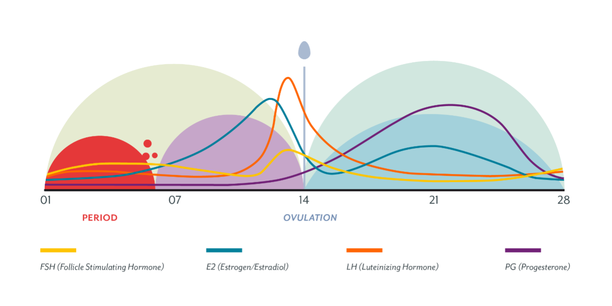
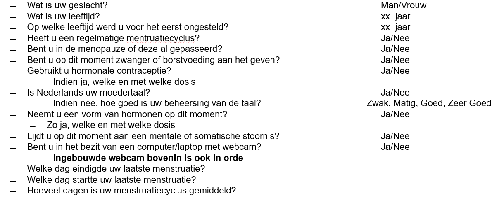

```{r setup, include=FALSE}
knitr::opts_chunk$set(echo = TRUE)
```

# PMS Study {.tabset}

This is an interactive, Shiny Rmd file for the PMS study

```{r libraries, include = FALSE}

    
#### Settings & Packages #### -----------------------------------------------------
rm(list = ls())

#install packages
list.of.packages <- c("lme4",'lmerTest','effects','dplyr', 'car', 'Rmisc', 'emmeans','fitdistrplus','ggplot2', 'ggstatsplot','ggsignif', 'ggformula','ggdist','ggpubr','ggeffects', 'gplots', 'gridExtra','tidyverse','pander','stringr','cowplot','lavaan','readr','jpeg','shiny','reshape2', 'yarrr','knitr', 'remotes', 'raincloudplots')
new.packages <- list.of.packages[!(list.of.packages %in% installed.packages()[,"Package"])]
if(length(new.packages)) install.packages(new.packages)

library(Rmisc)
library(raincloudplots)
library(lme4)
library(lmerTest)
library(effects)
library(dplyr)
library(car)
library(emmeans)
library(fitdistrplus)
library(gplots)
library(ggplot2)
library(ggstatsplot)
library(ggsignif)
library(ggformula)
library(ggdist)
library(ggpubr)
library(ggeffects)
library(gridExtra)
library(tidyverse)
library(pander)
library(stringr)
library(cowplot)
library(lavaan)
library(readr)
library(jpeg)
library(shiny)
library(reshape2)
library (yarrr)
# library(htmltools)
library(knitr)
library(remotes)
recode <- dplyr::recode
count <- dplyr::count 

# create folder to save figures
if (!dir.exists("figures")) dir.create("figures")
# General settings
nAGQ = 0 # When writing code, set to 0, when getting final results, set to 1ù
vpn = 1 # Set to 1 if using VPN
```


```{r load-data, echo=FALSE}
#### IMPORT data & INSPECTION #### -------------------------------------------------------------
# work_dir<-"Z:\\shares\\ghepmk_data\\2020_Kappen_PMS\\RMarkdown\\Data\\"
# setwd(work_dir)
# setwd(dirname(rstudioapi::getActiveDocumentContext()$path))
# if (vpn == 1){
#   dataDir = "Z:\\shares\\ghepmk_data\\2020_Kappen_PMS\\RMarkdown\\Data\\"
# } else {
#   dataDir = "Data\\"
# }
# data <- read.csv(paste0(dataDir,"allPMSdata.csv"), header=TRUE, sep=)
# norms <-read.table(paste0(dataDir,"FemaleSubjects_1-20.txt"), header=TRUE, fill=TRUE)

work_dir<-"C:/Users/ASUSTeK/OneDrive/Documenten/GitHub/internship_sofie"
setwd(work_dir)
data <- read.csv("Data/allPMSdata.csv", header=TRUE, sep=)
norms <-read.table('Data/FemaleSubjects_1-20.txt', header=TRUE, fill=TRUE)

norms$IAPS <-round(norms$IAPS)
un<-c('1440', '1463', '1610', '1710', '1722', '1750', '2057', '2070', '2160', '2165', '2340', '2360', '2800', '3261', '4180', '4290', '4490', '4531',  '4550', '4561', '4658', '5030', '5600', '5800', '5982', '6312', '6313', '7182', '7211', '7224', '7238', '7380', '7480', '7481', '9220', '9300', '9320', '9584', '9592', '9594', '9600', '9911', '9920', '9921') # all the unique(data$Stimulus) in a list
norms<-as.data.frame(norms) # make a dataframe
norms$row_num <- seq.int(nrow(norms)) # give row numbers
#move column with names 
norms <- norms %>%
  relocate(desc, .after=row_num)

norms<-subset(norms, IAPS%in% un ) #we now have table with the norms for ONLY the stimuli used in this PMS experiment

#we remove the second 1610 because it is double for some reason
norms<-norms[-c(4),]


data$Subject <- factor(data$ID)

levs<-union(data$ID, data$ID)
data$newid <- factor(data$ID, levels=levs, labels=seq_along(levs)) #this code replaces the '627, 534 IDs with 1, 2, 3, )

#we make a new variable that has value 1 for the first TestMoment and 2 for the second TestMoment
#These moments were counterbalanced
#when the order was B-A and the moment is B, this means it is the first test moment
#and vice versa for A-B and moment A. 

# TestMoment 1 == Follicular phase
# TestMoment 2 == Luteal phase
data$TestMoment[data$Order == "A-B" & data$Moment == "A"] = 1
data$TestMoment[data$Order == "B-A" & data$Moment == "A"] = 2
data$TestMoment[data$Order == "A-B" & data$Moment == "B"] = 2
data$TestMoment[data$Order == "B-A" & data$Moment == "B"] = 1
#check if there are still values missing (NA)
#sum(is.na(data$TestMoment))

# new variable PMSSCORE NEW iedereen pms 0 ook 0 iedereen die 1 OF 2 heeft wordt 1, 
data$PMSScoreNew[data$PMSScore==0] = 'noPMS'
data$PMSScoreNew[data$PMSScore==1] = 'PMS'
data$PMSScoreNew[data$PMSScore==2] = 'PMS' #PMDD, mr niet officiële diagnose dus gewoon PMS
#sum(is.na(data$PMSScoreNew))

#put rt in sec instead of ms
data$rt= data$rt/1000

# Check whether R recognizes the variable types correctly
#we make factors of the independable variables

data$PMSScore <- factor(data$PMSScore)
data$PMSScoreNew <- factor(data$PMSScoreNew)
data$Moment <- factor(data$TestMoment) # This removes "A and B", A == 1, B == 2 now

# Exclude data?

data_allcontraception <-data
# exclude everyone on the pill/copper spiral/other: only those with Natural Contraception are left included
data<-subset(data, Contraception!="Pill" & Contraception!="other" & Contraception!="Cop. Coil" & Contraception!="Hor. Coil" & Contraception!='Hor.Coil')

dataBig = data # Saved all the data here
data = data[, -which(names(data) == "X" | names(data) == "Stimulus" | names(data) == "Valence" | names(data) == "Arousal" | names(data) == "rt")] #removes these columns
data= distinct(data)


data <- subset(data,BSRI!=0 ) #remove datapoints where BSRI = 0

# Define the formula for the model & check which model fits the data best

data_temp <- data #to get back to
dataBig_out<-dataBig #the dataBig with the rt outliers
#Dit zijn de data waar de rt outliers uitgehaald zijn! 
dataBig2 <- subset(dataBig, rt < 16)

#now we add the sd and means from these data to this dataframe
# https://stackoverflow.com/questions/21982987/mean-per-group-in-a-data-frame
# norms$valmn_pms<- mean(dataBig2$Valence)

norms<-cbind(norms, round(ddply(dataBig2, .(Stimulus), summarize,  valmn_pms=mean(Valence))[2])/10)

norms<-cbind(norms, round(ddply(dataBig2, .(Stimulus), summarize,  aromn_pms=mean(Arousal))[2])/10)

norms<-cbind(norms, round(ddply(dataBig2, .(Stimulus), summarize,  valsd_pms=sd(Valence))[2])/10)

norms<-cbind(norms, round(ddply(dataBig2, .(Stimulus), summarize,  arosd_pms=mean(Arousal))[2])/10)

#make all columns unique!
colnames(norms)<-make.unique(names(norms))

# group stimuli depending on whether they are part of group A or group B in exp

A<-unique(dataBig2$Stimulus[dataBig2$Order=='A-B' & dataBig2$Moment==1])
B <-unique(dataBig2$Stimulus[dataBig2$Order=='B-A' & dataBig2$Moment==1])

norms$group[norms$IAPS %in% A]='A'
norms$group[norms$IAPS %in% B]='B'

```

```{r functions, echo=FALSE, results='asis'}

  # violin function

    geom_flat_violin <- function(mapping = NULL, data = NULL, stat = "ydensity",
                                 position = "dodge", trim = TRUE, scale = "area",
                                 show.legend = NA, inherit.aes = TRUE, ...) {
      layer(
      data = data,
      mapping = mapping,
      stat = stat,
      geom = GeomFlatViolin,
      position = position,
      show.legend = show.legend,
      inherit.aes = inherit.aes,
      params = list(
        trim = trim,
        scale = scale,
        ...
     )
    )
    }
GeomFlatViolin <-
  ggproto("GeomFlatViolin", Geom,
          setup_data = function(data, params) {
            data$width <- data$width %||%
              params$width %||% (resolution(data$x, FALSE) * 0.9)
            
            # ymin, ymax, xmin, and xmax define the bounding rectangle for each group
            data %>%
              group_by(group) %>%
              mutate(ymin = min(y),
                     ymax = max(y),
                     xmin = x,
                     xmax = x + width / 2)
            
          },
          
          draw_group = function(data, panel_scales, coord) {
            # Find the points for the line to go all the way around
            data <- transform(data, xminv = x,
                              xmaxv = x + violinwidth * (xmax - x))
            
            # Make sure it's sorted properly to draw the outline
            newdata <- rbind(plyr::arrange(transform(data, x = xminv), y),
                             plyr::arrange(transform(data, x = xmaxv), -y))
            
            # Close the polygon: set first and last point the same
            # Needed for coord_polar and such
            newdata <- rbind(newdata, newdata[1,])
            
            ggplot2:::ggname("geom_flat_violin", GeomPolygon$draw_panel(newdata, panel_scales, coord))
          },
          
          draw_key = draw_key_polygon,
          
          default_aes = aes(weight = 1, colour = "grey20", fill = "white", size = 0.5,
                            alpha = NA, linetype = "solid"),
          
          required_aes = c("x", "y")
)
    
    #standard error function
    standard_error <- function(x) sd(x)/sqrt(length(x))
    
    
    
#function for split violin
    GeomSplitViolin <- ggproto("GeomSplitViolin", GeomViolin, 
                           draw_group = function(self, data, ..., draw_quantiles = NULL) {
  data <- transform(data, xminv = x - violinwidth * (x - xmin), xmaxv = x + violinwidth * (xmax - x))
  grp <- data[1, "group"]
  newdata <- plyr::arrange(transform(data, x = if (grp %% 2 == 1) xminv else xmaxv), if (grp %% 2 == 1) y else -y)
  newdata <- rbind(newdata[1, ], newdata, newdata[nrow(newdata), ], newdata[1, ])
  newdata[c(1, nrow(newdata) - 1, nrow(newdata)), "x"] <- round(newdata[1, "x"])

  if (length(draw_quantiles) > 0 & !scales::zero_range(range(data$y))) {
    stopifnot(all(draw_quantiles >= 0), all(draw_quantiles <=
      1))
    quantiles <- ggplot2:::create_quantile_segment_frame(data, draw_quantiles)
    aesthetics <- data[rep(1, nrow(quantiles)), setdiff(names(data), c("x", "y")), drop = FALSE]
    aesthetics$alpha <- rep(1, nrow(quantiles))
    both <- cbind(quantiles, aesthetics)
    quantile_grob <- GeomPath$draw_panel(both, ...)
    ggplot2:::ggname("geom_split_violin", grid::grobTree(GeomPolygon$draw_panel(newdata, ...), quantile_grob))
  }
  else {
    ggplot2:::ggname("geom_split_violin", GeomPolygon$draw_panel(newdata, ...))
  }
})

geom_split_violin <- function(mapping = NULL, data = NULL, stat = "ydensity", position = "identity", ..., 
                              draw_quantiles = NULL, trim = TRUE, scale = "area", na.rm = FALSE, 
                              show.legend = NA, inherit.aes = TRUE) {
  layer(data = data, mapping = mapping, stat = stat, geom = GeomSplitViolin, 
        position = position, show.legend = show.legend, inherit.aes = inherit.aes, 
        params = list(trim = trim, scale = scale, draw_quantiles = draw_quantiles, na.rm = na.rm, ...))
}

```

## Intro


A lot of the people that get their periods feel unwell during the premenstrual phase of their cyclus. 
This study looked into stress, rumination and emotion expression during the premenstrual phase with both healthy women and women who have PMS, or Pre Menstrual Syndrome.

#### PMS

PMS is a clinical disorder that is characterized by behavioral and physical symptoms that occur during the luteal phase, which we will call the 'premenstrual phase' during this presentation


{width=80%}

The symptoms disappear 2-3 days into menstruation.

##### Symptoms

- decreased serotonin levels

- etiology and symptoms of PMS and depression are linked

### pMDD

PMDD (Premenstrual Dysphoric Disorder) has recently been added to the DSM, this is a more severe version of PMS.

##### Prevalence

- 75% of women experience some symptoms

- 20-30%: moderate to severe symptoms

- 5-8% PMDD levels of symptoms


### STUDY

##### Screening

{width=80%}

+ screening tool for premenstrual symptoms: 

- no/mild

- medium-severe


#### TestMoment

* determined per participant, based on cycle

* invitation via e-mail + 24 h reminder

* execution via LimeSurvey

* counterbalanced across participants

#### Measures

- PSS: Perceived Stress Scale

- Rating of 22 IAPS images while webcam records
  +  counterbalanced across TestMoment: e.g. during moment 1 a puppy, during moment 2 a different puppy. this order (serie A of images and serie B of images)

- Report experienced Valence, Arousal

{width=80%}

- BSRI: Brief State Rumination Index

{width=80%}

- question on webcam usability and comfort

### Hypotheses

#### control vs premenstrual phase:

- higher stress?

- more rumination? 

- more negative responses? explicit: ratings, implicit: video emotion expressions

### TODAY:

** implicit measures **


## PMS, TestMoment, PSS and BSRI

* #### PMS: 
three groups originally: low and high PMS and what counts as ... on the questionnaire. 
These two last groups were taken together to form the 'no PMS' and 'PMS' groups


* #### PSS
Perceived Stress Scale

add image norms


* #### BSRI:
Brief State RUmination Index

{width=80%}

image norms

Marchetti et al. The Brief State Rumination Inventory (BSRI): Validation and Psychometric Evaluation

add image norms


### Research Question: PMS vs no PMS: 
- PSS
- BSRI
+ Interactie testmoment


```{r echo=FALSE}
ui<- fluidPage( # makes the User Interface

    selectInput("formula_choice", label="Choose a Formula:",
            choices= c('PSS ~ TestMoment', 'BSRI ~ TestMoment', 'PSS~ PMSScoreNew*TestMoment', 'BSRI ~PMSScoreNew*TestMoment'),
            selected='PSS ~ TestMoment'), # puts the choices in the first element which is accessed via input$formula_choice

     tabsetPanel(type = "tab",
                  tabPanel("pirateplot", plotOutput("pirateplot")),
                 tabPanel("raincloud", plotOutput("raincloud")),
                 tabPanel("splitviolin", plotOutput("splitviolin")),
                 tabPanel("overlap", plotOutput("overlap")),
                 tabPanel("AIC table", tableOutput("table")),
                 tabPanel("Anova", verbatimTextOutput("Anova")),
                 tabPanel("emmeans",verbatimTextOutput("emmeans"))
         )
  
)

server <- function (input, output){ #we have to add this to the server
  
  
  output$pirateplot<- renderPlot({ 
      dpi=600    #pixels per square inch
    # jpeg(paste0(plotPrefix, "Figure", "_", plotTitles[i], ".jpeg"), width=8*dpi, height=4*dpi, res=dpi)
    par(mfcol = c(1, 1))
      pirateplot(
      formula= input$formula_choice,
      data=data,
      theme= 1,
      pal= "info",
      main= input$formula_choice,
      bean.f.o = .6, # Bean fill
      point.o = .3,  # Points
      inf.f.o = .7,  # Inference fill
      inf.b.o = .8,  # Inference border
      avg.line.o = 1,  # Average line
      bar.f.o = .5, # Bar
      inf.f.col = "white",  # Inf fill col
      inf.b.col = "black",  # Inf border col
      avg.line.col = "black",  # avg line col
      bar.f.col = gray(.8),  # bar filling color
      point.pch = 21,
      point.bg = "white",
      point.col = "black",
      point.cex = .7,
      xlab="",
    )

  }, height= 600)

  #https://wellcomeopenresearch.org/articles/4-63   some info on rainclouds
  output$raincloud <- renderPlot({
    if ((grepl("PSS", input$formula_choice))){
      p1 <- ggplot(data, aes(x = PMSScoreNew, y = PSS, fill=PMSScoreNew))+
        geom_flat_violin(position = position_nudge(x = .2, y = 0),adjust =2)+
        geom_boxplot(width= .15, outlier.shape = NA)+
        geom_point(position=position_jitter(width=.15), size=.25)+
        ylab('PSS')+xlab('PMSScoreNew')+coord_flip()+theme_cowplot()+
        theme(legend.position="none")+
        guides(fill=FALSE)+
        ggtitle("distribution PSS in PMS vs no PMS")
      p1
    }else{
      p2 <- ggplot(data, aes(x = PMSScoreNew, y = BSRI, fill=PMSScoreNew))+
        geom_flat_violin(position = position_nudge(x = .2, y = 0),adjust =2)+
        ylab('BSRI')+xlab('PMSScoreNew')+coord_flip()+theme_cowplot()+
        geom_boxplot(width= .15, outlier.shape = NA)+
        geom_point(position=position_jitter(width=.15), size=.25)+
        theme(legend.position="none")+
        guides(fill=FALSE)+
        ggtitle("distribution BSRI in PMS vs no PMS")
      p2
    }
  }, height=600)
  
    output$splitviolin <-renderPlot({
    if (grepl('PSS', input$formula_choice)){
      max_y<- max(as.integer(data$PSS))
      dmean<-summarySE(data, measurevar="PSS", groupvars=c('PMSScoreNew', 'Moment'))
        p<- ggplot(data, aes(x=Moment, y=PSS, fill=PMSScoreNew))+
          # geom_split_violin(adjust =1.5, alpha=.5)+
          geom_split_violin(adjust =1.5, alpha=.5, colour= NA)+
          geom_boxplot(aes(x = Moment, y = PSS, fill = PMSScoreNew), position= position_dodge(0.2),outlier.shape= NA, alpha = .5, width = .1, colour = "black")+
          geom_point(data = dmean, aes(x = as.numeric(Moment), y = PSS, group = PMSScoreNew, fill = PMSScoreNew), position= position_dodge(0.2), shape = 21, size=4)+
        scale_x_discrete(labels=c('1'='control', '2'='premenstrual'))+
          annotate('text', x=1, y=max_y+(max_y/10)+(max_y/100), label='*', size=8)+
          annotate('text', x=2, y=max_y+(max_y/10)+(max_y/100), label='*', size=8)+
          geom_segment(aes(x = 0.955, y = (max_y+(max_y/10)-(max_y/80)), xend = 1.055, yend = (max_y+(max_y/10)-(max_y/80))), size= 2)+
          geom_segment(aes(x = 1.955, y = (max_y+(max_y/10)-(max_y/80)), xend = 2.055, yend = (max_y+(max_y/10)-(max_y/80))), size= 2)+
          ggtitle('PSS ~ PMS * TestMoment')
        p
    
        } else if (grepl('BSRI', input$formula_choice)){
        max_y<-max(as.integer(data$BSRI))
      dmean<-summarySE(data, measurevar="BSRI", groupvars=c('PMSScoreNew', 'Moment'))
        p<- ggplot(data, aes(x=Moment, y=BSRI, fill=PMSScoreNew))+
          # geom_split_violin(adjust =1.5, alpha=.5)+
          geom_split_violin(adjust =1.5, alpha=.5, colour= NA)+
          geom_boxplot(aes(x = Moment, y = BSRI, fill = PMSScoreNew), position= position_dodge(0.2),outlier.shape= NA, alpha = .5, width = .1, colour = "black")+
          geom_point(data = dmean, aes(x = as.numeric(Moment), y = BSRI, group = PMSScoreNew, fill = PMSScoreNew), position= position_dodge(0.2), shape = 21, size=4)+
        scale_x_discrete(labels=c('1'='control', '2'='premenstrual'))+
          annotate('text', x=1, y=max_y+(max_y/10)+(max_y/100), label='*', size=8)+
          annotate('text', x=2, y=max_y+(max_y/10)+(max_y/100), label='**', size=8)+
          geom_segment(aes(x = 0.955, y = (max_y+(max_y/10)-(max_y/80)), xend = 1.055, yend = (max_y+(max_y/10)-(max_y/80))), size= 2)+
          geom_segment(aes(x = 1.955, y = (max_y+(max_y/10)-(max_y/80)), xend = 2.055, yend = (max_y+(max_y/10)-(max_y/80))), size= 2)+
          ggtitle('PSS ~ PMS * TestMoment')
        p
        } 
  }, height=600)
  

      
     models <- reactive({ # we need to create this within a reactive context to be able to access the formula_choice
        m <- c()
        # Formula <- 'DASS_Stress ~ PMSScoreNew + (1|Subject)'
        Formula <- paste0(input$formula_choice, '+ (1|Subject)')
        tryCatch(
          { d0.1 <- lmer(Formula,data=data); # if this formula works
          m <- c(m, d1=d0.1)}, #we add this
          error=function(e){})
        tryCatch(
          { d0.2 <- glmer(Formula,data=data, family = gaussian(link = "inverse"),glmerControl(optimizer= "bobyqa", optCtrl = list(maxfun = 100000)),nAGQ=nAGQ); 
          m <- c(m, d1=d0.2)}, 
          error=function(e){})
        tryCatch(
          { d0.3 <- glmer(Formula,data=data, family = gaussian(link = "log"),glmerControl(optimizer= "bobyqa", optCtrl = list(maxfun = 100000)),nAGQ=nAGQ); 
          m <- c(m, d3=d0.3)}, 
          error=function(e){})
        tryCatch(
          { d0.4 <- glmer(Formula,data=data, family = Gamma(link = "identity"),glmerControl(optimizer= "bobyqa", optCtrl = list(maxfun = 100000)),nAGQ=nAGQ); 
          m <- c(m, d4=d0.4)}, 
          error=function(e){})
        tryCatch(
          { d0.5 <- glmer(Formula,data=data, family = Gamma(link = "inverse"),glmerControl(optimizer= "bobyqa", optCtrl = list(maxfun = 100000)),nAGQ=nAGQ); 
          m <- c(m, d5=d0.5) }, 
          error=function(e){})
        tryCatch(
          { d0.6 <- glmer(Formula,data=data, family = Gamma(link = "log"),glmerControl(optimizer= "bobyqa", optCtrl = list(maxfun = 100000)),nAGQ=nAGQ); 
          m <- c(m, d6=d0.6) }, 
          error=function(e){})
        tryCatch(
          { d0.7 <- glmer(Formula,data=data, family = inverse.gaussian(link = "identity"),glmerControl(optimizer= "bobyqa", optCtrl = list(maxfun = 100000)),nAGQ=nAGQ);
          models <- c(models, d7=d0.7) }, 
          error=function(e){})
        tryCatch(
          { d0.8 <- glmer(Formula,data=data, family = inverse.gaussian(link = "inverse"),glmerControl(optimizer= "bobyqa", optCtrl = list(maxfun = 100000)),nAGQ=nAGQ); 
          m <- c(m, d8=d0.8) }, 
          error=function(e){})
        tryCatch(
          { d0.9 <- glmer(Formula,data=data, family = inverse.gaussian(link = "log"),glmerControl(optimizer= "bobyqa", optCtrl = list(maxfun = 100000)),nAGQ=nAGQ); 
          m <- c(m, d9=d0.9) }, 
          error=function(e){})
        m
     })
     
 output$table <-renderTable({
  modelNames<-c()
  tabel<-c()
  for (i in 1:length(models())){
    modelNames<-c(modelNames, names(models()[i]))
    AIC<-AIC(models()[[i]])
    tabel <- c (tabel, round(AIC))}
    chosenModel = modelNames[which(tabel == min(tabel))]
    tabel <- data.frame(Models=c('chosen  Model:', modelNames), AIC= c(chosenModel, tabel))
    tabel
})
  
output$Anova <- renderPrint({
  tabel<-c()
  for (i in 1:length(models())){
      AIC<- AIC(models()[[i]])
      tabel <- c(tabel,round(AIC))}
  chosenModel<-models()[which(tabel == min(tabel))]
     Anova_1 <- Anova(chosenModel[[1]])
     cat(sprintf("\nAnova\n"))
     Anova_1
  })
  
output$emmeans <- renderPrint({
  tabel<-c()
  for (i in 1:length(models())){
      AIC<- AIC(models()[[i]])
      tabel <- c(tabel,round(AIC))}
  chosenModel<-models()[which(tabel == min(tabel))]
    cat(sprintf("\n formula: %s\n", input$formula_choice))
    if ((grepl("PMS", input$formula_choice)==FALSE)){
      cat(sprintf("\n~ TestMoment\n"))
      Emm <- emmeans(chosenModel[[1]], pairwise ~ TestMoment, adjust ="fdr", type="response")
      print(Emm)}
    if (grepl("PMS", input$formula_choice)){
      cat(sprintf("\n~ PMS*TestMoment\n"))
      Emm <- emmeans(chosenModel[[1]], pairwise ~ PMSScoreNew*TestMoment, adjust ="fdr", type="response")
      print(Emm)}
  })
  


}
shinyApp(ui=ui, server=server, options=list(height=800))

```
we do (G)LMM: generalized linear mixed models
stress(PSS) or gender(BSRI) as dependable variable
PMS(2 levels) x TestMoment (2 levels)

AIC: Akaike Information Criterion: says which model best (lowest AIC) om beste fit model te vinden.

### conclusions

=> PSS is higher in testmoment 2: luteal phase
sign effect of PMS on PSS
no sign difference between testmoment 1 and 2 with the PMS group!


=>gender difference of PMS vs no PMS: PMS group more 'androgynous'
BSRI is higher in PMS than in noPMS group
-no effect of testmoment on BSRI

### Norm Groups PSS (young) women

```{r echo=FALSE}

mean(data$PSS)
max(data$PSS)
min(data$PSS)

```

Women have on average higher stress scales

Perceived Stress Scale Sheldon Cohen
women: mean=13.7, SD:6.6
men: mean:12.1, SD: 5.9
age 18-29: 14.2, SD: 6.2
30-44: 13, 6.2
45-54: 12.6, 6.1

KIJK of we zelfde PSS items gebruiken


https://bmcpsychiatry.biomedcentral.com/articles/10.1186/s12888-016-0875-9/tables/6
women age 20-29: Mn=8.2, SD= 4.6
women age 40-40: Mn=7.6, SD= 4.2

https://www.frontiersin.org/files/Articles/558691/fpsyt-11-558691-HTML/image_m/fpsyt-11-558691-t003.jpg

mean score of the population; 18.10 (moderate stress level)

https://www.dovepress.com/cr_data/article_fulltext/s317000/317059/img/PRBM_A_317059_t0002.jpg

PSS during pandemic:D
https://www.ncbi.nlm.nih.gov/pmc/articles/PMC7680058/

## DASS

* #### DASS-21_R
Depression Anxiety Stress Scale
DASS: 3 subschalen
DASS_Total, DASS_Stress, DASS_Anxiety, DASS_Depression
effect of PMS vs no PMSS
-geen interactie want het is trait: mr 1 afname
-wel interactie PSS: trait vs state?

#### onderzoeksvraag: PMS vs noPMS voor:
- DASS_alle subschalen
+interactie PSS


```{r echo=FALSE}

ui<- fluidPage( # makes the User Interface

    selectInput("formula_choice", label="Choose a Formula:",
            choices= c('DASS_Stress ~ PMSScoreNew', 'DASS_Anxiety ~ PMSScoreNew', 'DASS_Depression ~ PMSScoreNew'),
            selected='DASS_Stress ~ PMSScoreNew'), # puts the choices in the first element which is accessed via input$formula_choice

     tabsetPanel(type = "tab",
                  tabPanel("pirateplot", plotOutput("pirateplot")),
                  tabPanel("raincloud", plotOutput("raincloud")),
                 tabPanel("splitviolin", plotOutput("splitviolin")),
                 tabPanel("AIC table", tableOutput("table")),
                 tabPanel("Anova", verbatimTextOutput("Anova")),
                 tabPanel("emmeans",verbatimTextOutput("emmeans"))
         ))

server <- function (input, output){ #we have to add this to the server


  output$pirateplot<- renderPlot({
      dpi=600    #pixels per square inch
    par(mfcol = c(1, 1))
      pirateplot(
      formula= input$formula_choice,
      data=data,
      theme= 1,
      pal= "info",
      main= input$formula_choice,
      bean.f.o = .6, # Bean fill
      point.o = .3,  # Points
      inf.f.o = .7,  # Inference fill
      inf.b.o = .8,  # Inference border
      avg.line.o = 1,  # Average line
      bar.f.o = .5, # Bar
      inf.f.col = "white",  # Inf fill col
      inf.b.col = "black",  # Inf border col
      avg.line.col = "black",  # avg line col
      bar.f.col = gray(.8),  # bar filling color
      point.pch = 21,
      point.bg = "white",
      point.col = "black",
      point.cex = .7,
      xlab="",
    )
  }, height=600)

  #https://wellcomeopenresearch.org/articles/4-63   some info on rainclouds
  #PMS vs noPMS over 2 fases Testmoment, https://github.com/jorvlan/raincloudplots
    output$raincloud <- renderPlot({
      if ((grepl("Stress", input$formula_choice))){
        p1 <- ggplot(data, aes(x = PMSScoreNew, y = DASS_Stress, fill=PMSScoreNew))+
          geom_flat_violin(position = position_nudge(x = .2, y = 0),adjust =2)+
          geom_boxplot(width= .15, outlier.shape = NA)+
          geom_point(position=position_jitter(width=.15), size=.25)+
          ylab('Stress')+xlab('PMS')+coord_flip()+theme_cowplot()+
          theme(legend.position="none")+
          guides(fill=FALSE)+
          ggtitle("distribution Stress in PMS vs no PMS")

      }else if ((grepl("Anxiety", input$formula_choice))){
        p2 <- ggplot(data, aes(x = PMSScoreNew, y = DASS_Anxiety, fill=PMSScoreNew))+
          geom_boxplot(width= .15, outlier.shape = NA)+
          geom_flat_violin(position = position_nudge(x = .2, y = 0),adjust =2)+
          geom_point(position=position_jitter(width=.15), size=.25)+
          ylab('Stress')+xlab('PMS')+coord_flip()+theme_cowplot()+
          theme(legend.position="none")+
          guides(fill=FALSE)+
          ggtitle("distribution Anxiety in PMS vs no PMS")
        p2
      }else {
        p2 <- ggplot(data, aes(x = PMSScoreNew, y = DASS_Anxiety, fill=PMSScoreNew))+
          geom_flat_violin(position = position_nudge(x = .2, y = 0),adjust =2)+
          #geom_boxplot(width= .15, outlier.shape = NA)+
          geom_point(position=position_jitter(width=.15), size=.25)+
          ylab('Stress')+xlab('PMS')+coord_flip()+theme_cowplot()+
          theme(legend.position="none")+
          guides(fill=FALSE)+
          ggtitle("distribution Depression in PMS vs no PMS")
        p2
      }
    }, height=600)
    
  p_pms <-reactive({
    p<-(p()[[3]][1]) # this gets the p-value of the first row, for PMS
    star=c()
    if (p> 0.05) {star=''
    }else if (p<0.0005){star='***'
    }else if (p<0.005){star='**'
    }else if (p<0.05) {star='*'}
    star
  })
  
  p<-reactive({
        tabel<-c()
    for (i in 1:length(models())){
        AIC<- AIC(models()[[i]])
        tabel <- c(tabel,round(AIC))}
    chosenModel<-models()[which(tabel == min(tabel))]
       Anova_1 <- Anova(chosenModel[[1]])
       cat(sprintf("\nAnova\n"))
       Anova_1
  })
  
  ### Make split raincloud plot by just making two seperate rainclouds and plotting over each other! 

    
    output$splitviolin <- renderPlot({
      if ((grepl("Stress", input$formula_choice))){
        max_y<-max(as.integer(data$DASS_Stress))
        dmean<-summarySE(data, measurevar="DASS_Stress", groupvars=c('PMSScoreNew', 'Moment'))
         p<- ggplot(data, aes(x=1, y=DASS_Stress, fill=PMSScoreNew))+
            geom_split_violin(adjust =1.5, alpha=.5)+
            geom_boxplot(aes(x = 1, y = DASS_Stress, fill = PMSScoreNew), position= position_dodge(0.2),outlier.shape= NA, alpha = .5, width = .1, colour = "black")+
            geom_point(data = dmean, aes(x = 1, y = DASS_Stress, group = PMSScoreNew, fill = PMSScoreNew), position= position_dodge(0.6), shape = 21, size=4)+
            annotate('text', x=1, y=max_y+(max_y/10)+(max_y/100), label=sprintf("\n%s\n", p_pms()), size=10)+
           # annotate('text', x=1, y=max_y+(max_y/10)+(max_y/100), label='3', size=10)+
            geom_segment(aes(x = 0.955, y = (max_y+(max_y/10)-(max_y/80)), xend = 1.055, yend = (max_y+(max_y/10)-(max_y/80))), size= 2)+
            ggtitle('DASS_Stress ~ PMS')
          p
      }  else if ((grepl("Anxiety", input$formula_choice))) {
        max_y<-max(as.integer(data$DASS_Anxiety))
        dmean<-summarySE(data, measurevar="DASS_Anxiety", groupvars=c('PMSScoreNew', 'Moment'))
         p<- ggplot(data, aes(x=1, y=DASS_Anxiety, fill=PMSScoreNew))+
            geom_split_violin(adjust =1.5, alpha=.5)+
            geom_boxplot(aes(x = 1, y = DASS_Anxiety, fill = PMSScoreNew), position= position_dodge(0.2),outlier.shape= NA, alpha = .5, width = .1, colour = "black")+
            geom_point(data = dmean, aes(x = 1, y = DASS_Anxiety, group = PMSScoreNew, fill = PMSScoreNew), position= position_dodge(0.2), shape = 21, size=4)+
            annotate('text', x=1, y=max_y+(max_y/10)+(max_y/100), label=sprintf("\n%s\n", p_pms()), size=10)+
            geom_segment(aes(x = 0.955, y = (max_y+(max_y/10)-(max_y/80)), xend = 1.055, yend = (max_y+(max_y/10)-(max_y/80))), size= 2)+
          p
      } else {
        max_y<-max(as.integer(data$DASS_Depression))
        dmean<-summarySE(data, measurevar="DASS_Depression", groupvars=c('PMSScoreNew', 'Moment'))
         p<- ggplot(data, aes(x=1, y=DASS_Depression, fill=PMSScoreNew))+
            geom_split_violin(adjust =1.5, alpha=.5)+
            geom_boxplot(aes(x = 1, y = DASS_Depression, fill = PMSScoreNew), position= position_dodge(0.2),outlier.shape= NA, alpha = .5, width = .1, colour = "black")+
            geom_point(data = dmean, aes(x = 1, y = DASS_Depression, group = PMSScoreNew, fill = PMSScoreNew), position= position_dodge(0.2), shape = 21, size=4)+
            annotate('text', x=1, y=max_y+(max_y/10)+(max_y/100), label=sprintf("\n%s\n", p_pms()), size=10)+
            geom_segment(aes(x = 0.955, y = (max_y+(max_y/10)-(max_y/80)), xend = 1.055, yend = (max_y+(max_y/10)-(max_y/80))), size= 2)+
            ggtitle('DASS_Depression ~ PMS')
          p
          
          
          
                  max_y<-max(as.integer(data$DASS_Depression))
        dmean<-summarySE(data, measurevar="DASS_Depression", groupvars=c('PMSScoreNew', 'Moment'))
         p<- ggplot(data, aes(x=1, y=DASS_Depression, fill=PMSScoreNew))+
            geom_split_violin(adjust =1.5, alpha=.5)+
            geom_boxplot(aes(x = 1, y = DASS_Depression, fill = PMSScoreNew), position= position_dodge(0.2),outlier.shape= NA, alpha = .5, width = .1, colour = "black")+
            geom_point(data = dmean, aes(x = 1, y = DASS_Depression, group = PMSScoreNew, fill = PMSScoreNew), position= position_dodge(0.2), shape = 21, size=4)+
            annotate('text', x=1, y=max_y+(max_y/10)+(max_y/100), label=sprintf("\n%s\n", p_pms()), size=10)+
            geom_segment(aes(x = 0.955, y = (max_y+(max_y/10)-(max_y/80)), xend = 1.055, yend = (max_y+(max_y/10)-(max_y/80))), size= 2)+
            ggtitle('DASS_Depression ~ PMS')
          p
          
      }
      
    }, height=600)
    
    
     models <- reactive({ # we need to create this within a reactive context to be able to access the formula_choice
        m <- c()
        # Formula <- 'DASS_Stress ~ PMSScoreNew + (1|Subject)'
        Formula <- paste0(input$formula_choice, '+ (1|Subject)')
        tryCatch(
          { d0.1 <- lmer(Formula,data=data); # if this formula works
          m <- c(m, d1=d0.1)}, #we add this
          error=function(e){})
        tryCatch(
          { d0.2 <- glmer(Formula,data=data, family = gaussian(link = "inverse"),glmerControl(optimizer= "bobyqa", optCtrl = list(maxfun = 100000)),nAGQ=nAGQ); 
          m <- c(m, d1=d0.2)}, 
          error=function(e){})
        tryCatch(
          { d0.3 <- glmer(Formula,data=data, family = gaussian(link = "log"),glmerControl(optimizer= "bobyqa", optCtrl = list(maxfun = 100000)),nAGQ=nAGQ); 
          m <- c(m, d3=d0.3)}, 
          error=function(e){})
        tryCatch(
          { d0.4 <- glmer(Formula,data=data, family = Gamma(link = "identity"),glmerControl(optimizer= "bobyqa", optCtrl = list(maxfun = 100000)),nAGQ=nAGQ); 
          m <- c(m, d4=d0.4)}, 
          error=function(e){})
        tryCatch(
          { d0.5 <- glmer(Formula,data=data, family = Gamma(link = "inverse"),glmerControl(optimizer= "bobyqa", optCtrl = list(maxfun = 100000)),nAGQ=nAGQ); 
          m <- c(m, d5=d0.5) }, 
          error=function(e){})
        tryCatch(
          { d0.6 <- glmer(Formula,data=data, family = Gamma(link = "log"),glmerControl(optimizer= "bobyqa", optCtrl = list(maxfun = 100000)),nAGQ=nAGQ); 
          m <- c(m, d6=d0.6) }, 
          error=function(e){})
        tryCatch(
          { d0.7 <- glmer(Formula,data=data, family = inverse.gaussian(link = "identity"),glmerControl(optimizer= "bobyqa", optCtrl = list(maxfun = 100000)),nAGQ=nAGQ);
          models <- c(models, d7=d0.7) }, 
          error=function(e){})
        tryCatch(
          { d0.8 <- glmer(Formula,data=data, family = inverse.gaussian(link = "inverse"),glmerControl(optimizer= "bobyqa", optCtrl = list(maxfun = 100000)),nAGQ=nAGQ); 
          m <- c(m, d8=d0.8) }, 
          error=function(e){})
        tryCatch(
          { d0.9 <- glmer(Formula,data=data, family = inverse.gaussian(link = "log"),glmerControl(optimizer= "bobyqa", optCtrl = list(maxfun = 100000)),nAGQ=nAGQ); 
          m <- c(m, d9=d0.9) }, 
          error=function(e){})
        m
     })
  output$table <-renderTable({
    modelNames<-c()
    tabel<-c()
    for (i in 1:length(models())){
      modelNames<-c(modelNames, names(models()[i]))
      AIC<-AIC(models()[[i]])
      tabel <- c (tabel, round(AIC))}
      chosenModel = modelNames[which(tabel == min(tabel))]
      tabel <- data.frame(Models=c('chosen  Model:', modelNames), AIC= c(chosenModel, tabel))
      tabel
  })

  output$Anova <- renderPrint({
       cat(sprintf("\nAnova\n"))
       p()
    })
  
  output$emmeans <- renderPrint({
  tabel<-c()
  for (i in 1:length(models())){
      AIC<- AIC(models()[[i]])
      tabel <- c(tabel,round(AIC))}
  chosenModel<-models()[which(tabel == min(tabel))]
    cat(sprintf("\n emmeans of formula: %s\n", input$formula_choice))
      Emm <- emmeans(chosenModel[[1]], pairwise ~ PMSScoreNew, adjust ="fdr", type="response")
      print(Emm)
  })

}


shinyApp(ui=ui, server=server, options=list(height=800))

```

### Conclusions
* sign more stress PMS than no PMS
* sign more anxiety PMS than no 
* sign more depression PMS than no PMS

### Interpretation of DASS => put markers:

{width=80%}


## reaction times

we plot the reaction times to find the outliers and filter the data

```{r echo=FALSE}
#plot reaction times with raincloudplot
d<-melt(data.frame(rt=c(dataBig_out$rt))) # we melt to wide format 
p1 <- ggplot(d, aes(x = variable, y = value, fill=variable))+
  geom_flat_violin(position = position_nudge(x = .2, y = 0),adjust =2)+
  ylab('rt')+xlab('amount')+coord_flip()+theme_cowplot()+
  geom_point(position=position_jitter(width=.15), size=2)+
  geom_boxplot(width= .10, outlier.shape = NA)+
  theme(legend.position="none")+
  ggtitle("reaction times with outliers")
p1

print('some summary info')
summary(dataBig_out$rt)
#outlier removal method 2

upper_bound <- quantile (dataBig_out$rt, 0.9985)
print('upper 99.85% bound')
upper_bound

defaultW<-getOption("warn")
options(warn=-1)# this disables warning messages
dataBig_out <- subset(dataBig_out, rt < 30)
d<-melt(data.frame(rt=c(dataBig_out$rt)))
p3 <- ggplot(d, aes(x = variable, y = value, fill=variable))+
  geom_flat_violin(position = position_nudge(x = .2, y = 0),adjust =2)+
  geom_point(position=position_jitter(width=.15), size=0.25)+
  ylab('rt')+xlab('amount')+coord_flip()+theme_cowplot()+
  geom_boxplot(width= .10, outlier.shape = NA)+
  theme(legend.position="none")+
  guides(fill=FALSE)+
  ggtitle("reaction times < 16 sec")
p3

options(warn=defaultW)#put warnings back on
print('some summary info')
summary(dataBig_out$rt)
#outlier removal method 2


out<-boxplot.stats(dataBig_out$rt)$out#outliers
out_ind<-which(dataBig_out$rt %in% c(out))#row numbers that contain outliers
boxplot(dataBig_out$rt, ylab='rt') #boxplot
mtext(paste('boxplot with outliers')) #boxplot with outliers

```


## Stimuli

These were images that were either negative, positive or neutral. 
22 matched images (e.g. in TestMoment 1 image of needle in arm, in TestMoment 2 needle in leg. or image puppy and image of another puppy)

participants could indicate how the images scored for them on valence and arousal

these already have the rt data filtered under 16 sec (outliers removed)

we look at how people answer on the stimuli: can we categorize the stimuli in valence and arousal? Are there weird answers? 

```{r echo=FALSE}

# unique<-sort(unique(dataBig$Stimulus), decreasing=FALSE) #find all the stimuli
# we maken een density plotvoor zowel valence als arousal voor elke stimulus (2x22)

ui<- fluidPage( 
    radioButtons("stimulus", label="Choose a Stimulus:",
            choices= c('1440', '1463', '1610', '1710', '1722', '1750', '2057', '2070', '2160', '2165', '2340', '2360', '2800', '3261', '4180', '4290', '4490', '4531',  '4550', '4561', '4658', '5030', '5600', '5800', '5982', '6312', '6313', '7182', '7211', '7224', '7238', '7380', '7480', '7481', '9220', '9300', '9320', '9584', '9592', '9594', '9600', '9911', '9920', '9921'), inline=TRUE,
            selected='1440'),
    tabsetPanel(type = "tab",
      tabPanel("densityplot", plotOutput("densityplot")),
      tabPanel("IAPs_Image", plotOutput("IAPs_Image"))
    )
)

server <- function (input, output){ 
  #we make a density plot of valence/arousal per stimulus.
  output$densityplot<- renderPlot({
    d<-melt(data.frame(valence=c(dataBig2$Valence[dataBig2$Stimulus==input$stimulus]),arousal=c(dataBig2$Arousal[dataBig2$Stimulus==input$stimulus])))
    d2<-data.frame(valence=c(dataBig2$Valence[dataBig2$Stimulus==input$stimulus]), ID=c(dataBig2$newid[dataBig2$Stimulus==input$stimulus])) 
    min<-d2$ID[which(d2$valence==min(d2$valence))]#ids of min valence
    max<-d2$ID[which(d2$valence==max(d2$valence))]#ids of max valence
    if (length(min)<length(max)){text=min } else {text=max}
    
    pirateplot(
      formula=value~variable,
      data=d,
      main= input$stimulus,
      xlab= str_glue('outlier: {text}'))
  }, height=600)
  
  output$IAPs_Image <- renderImage({
    list(src=str_glue("Z:/shares/ghep_lab/ImageDatabases/IAPS/{input$stimulus}.jpg"),
         filetype="image/jpeg",
         width=400,
         height=300)
  })
}
shinyApp(ui=ui, server=server, options= list(height=800))

```


#### outliers newid's:

25: VI: times a negative reaction to nakedness/sex: 4180, 4290, 4490, 4550, 4561,4658
75: IV: neg reactie nakedness and sex (4531, 4490, 4180, 4658)
145: II, neg reaction nakedness (4290, 4561)
284: III: neg reactie baby (2057, 2070, 2165)

47: II: neg reaction to clouds (5982) and positive to a needle in an arm (9594)
89: II: pos reactie op trippy schilderijen (7182, 7238)
169: II: pos reactie op vrouw gered dr brandweer (9921)
194: II: neg reactie ijsbergen (5600) en pasta (194)
1: II: antwoord altijd 0 of 100, ook op saaie kast (7224), schilderij (7238)

one-time outliers:    
10  27  30  31  40  74  97 100 119 121 128 134 136 167 168 206 221
233 240 244 251 252 257 259 262 293 315 334 351 365 374 376


'medium'= 40-60

|  |  |
|:----|:----------------------|
|  **high valence, high arousal:** | 4658, 4561, 4658  |
| **high valence, low arousal:** |  2360, 5030, 5600, 5800, 5982, 5030, 5800, 5982 |
| **high valence, medium arousal:** | 1440, 1463, 1610, 1710, 1722, 1750, 2057, 2070, 2160, 2165, 2340 7480, 7481, 5600, 7480, 7481 |
| **low valence, high arousal:** | 2800, 3261, 6312, 6313, 7182, 7380, 6312, 6313, 7380, 9600, 9911, 9920, 9921 |
| **low valence, low arousal:** |  9220 |
| **low valence, medium arousal:** | 9300, 9320, 9584, 9592, 9594 |
| **medium valence, high arousal:** | 7182 |
| **medium valence, low arousal:** |  7224, 7224 |
| **medium valence, medium arousal:** |  7211, 7238, 4550, 7211, 7238 |

when Medium, arousal tends to be normally distributed
However: we often find 2 gauss curves on top of each other
same for valence: more of a gaussian curve when middle, more of a cup when towards the extreme.


### mean reactions over all stimuli
plot mean reaction per participant over all stimuli: 
-mean valence
-mean arousal
-standard deviation


### Statistics

- plot means valence & arousal between groups (PMS, noPMS) on stimuli

- plot means testmoment x PMS

- statistical analysis: sign differences? 

```{r echo=FALSE}
ui<- fluidPage( 
      selectInput("formula_choice", label="Choose a Formula:",
            choices= c('Valence~PMSScoreNew', 'Arousal~PMSScoreNew', 'Valence~PMSScoreNew * TestMoment', 'Arousal ~ PMSScoreNew * TestMoment'),
            selected='Valence~PMSScoreNew'),
    tabsetPanel(type = "tab",        
      tabPanel("pirateplot", plotOutput("pirateplot")),
      tabPanel('plotmeans', plotOutput('plotmeans')),
      tabPanel('splitviolin', plotOutput('splitviolin')),
      tabPanel('int_means', plotOutput('int_means')),
      tabPanel("AIC table", tableOutput("table")),
      tabPanel("Anova", verbatimTextOutput("Anova")),
      tabPanel("emmeans",verbatimTextOutput("emmeans"))
    )
)


server <- function (input, output){ 
  p_pms <-reactive({
    p<-(p()[[3]][1]) # this gets the p-value of the first row, for PMS
    star=c()
    if (p> 0.05) {star=''
    }else if (p<0.0005){star='***'
    }else if (p<0.005){star='**'
    }else if (p<0.05) {star='*'}
    star
  })
  
  #for emmeans: em[[2]][1] is the p-value for first row
  
  #we make a density plot of valence/arousal per stimulus.
  output$pirateplot<- renderPlot({
    pirateplot(
          formula= input$formula_choice,
          data=dataBig2,
          theme= 1,
          pal= "info",
          main= input$formula_choice,
          bean.f.o = .6, # Bean fill
          point.o = .05,  # Points
          inf.f.o = .7,  # Inference fill
          inf.b.o = .8,  # Inference border
          avg.line.o = 1,  # Average line
          bar.f.o = .5, # Bar
          inf.f.col = "white",  # Inf fill col
          inf.b.col = "black",  # Inf border col
          avg.line.col = "black",  # avg line col
          bar.f.col = gray(.8),  # bar filling color
          point.pch = 21,
          point.bg = "white",
          point.col = "black",
          point.cex = .7,
          xlab="",
        )
  }, height=600)
  
  output$plotmeans <-renderPlot({
    if (grepl('Arousal', input$formula_choice) &grepl('TestMoment', input$formula_choice)){
      dmean<-summarySE(dataBig2, measurevar="Arousal", groupvars=c('PMSScoreNew', 'Moment'))
        p3 <- ggplot(dataBig2, aes(x=Moment, y=Arousal, fill=PMSScoreNew))+
          geom_flat_violin (aes(fill=PMSScoreNew), position= position_nudge(x=.1, y=0), adjust=1.5, alpha= .5, colour=NA)+
          geom_boxplot(aes(x=Moment, y=Arousal, fill=PMSScoreNew), outlier.shape=NA, alpha=.5, width=.1, colour='black')+
          geom_line(data=dmean, aes(x= as.numeric(Moment)+.1, y=Arousal, group=PMSScoreNew, colour=PMSScoreNew), size=1.5)+
          geom_point(data = dmean, aes(x = as.numeric(Moment)+.1, y = Arousal, group = PMSScoreNew, fill= PMSScoreNew), shape = 21, size=6)+
          scale_x_discrete(labels=c('1'='control', '2'='premenstrual'))+
          annotate('text', x=1, y=105, label='*', size=8)+
          annotate('text', x=2, y=105, label='*', size=8)+
          geom_segment(aes(x = 0.97, y = 103, xend = 1.03, yend = 103), size= 2)+
          geom_segment(aes(x = 1.97, y = 103, xend = 2.03, yend = 103), size= 2)+
          ggtitle('Arousal ~ PMSScoreNew * TestMoment')
        p3
    
        }else if (grepl('Valence', input$formula_choice) & grepl('TestMoment', input$formula_choice)){
      dmean<-summarySE(dataBig2, measurevar="Valence", groupvars=c('PMSScoreNew', 'Moment'))
        p3 <- ggplot(dataBig2, aes(x=Moment, y=Valence, fill=PMSScoreNew))+
          geom_flat_violin (aes(fill=PMSScoreNew), position= position_nudge(x=.1, y=0), adjust=1.5, alpha= .5, colour=NA)+
          geom_boxplot(aes(x=Moment, y=Valence, fill=PMSScoreNew), outlier.shape=NA, alpha=.5, width=.1, colour='black')+
          geom_line(data=dmean, aes(x= as.numeric(Moment)+.1, y=Valence, group=PMSScoreNew, colour=PMSScoreNew), size=1.5)+
          geom_point(data = dmean, aes(x = as.numeric(Moment)+.1, y = Valence, group = PMSScoreNew, fill=PMSScoreNew), shape = 21, size=6)+
          scale_x_discrete(labels=c('1'='control', '2'='premenstrual'))+
          ggtitle('Valence~PMSScoreNew * TestMoment')
        p3
    }
    else if (grepl('Arousal', input$formula_choice) & !grepl('TestMoment', input$formula_choice)){
      dmean<-summarySE(dataBig2, measurevar="Arousal", groupvars=c('PMSScoreNew'))
          p1 <- ggplot(dataBig2, aes(x = PMSScoreNew, y = Arousal)) +
            geom_flat_violin(aes(fill=PMSScoreNew),position = position_nudge(x =.2, y = -1), adjust = 1.5, alpha = .5, colour = NA)+
            geom_point(aes(colour=PMSScoreNew),position=position_jitter(width=.15), size=.25)+
            geom_boxplot(aes(x = PMSScoreNew, y = Arousal, fill = PMSScoreNew),outlier.shape= NA, width = .1, colour = "black")+
            geom_point(data = dmean, aes(x = as.numeric(PMSScoreNew)+.2, y = Arousal, fill=PMSScoreNew), shape = 21, size=6)+
             geom_line(data=dmean, aes(x=as.numeric(PMSScoreNew)+.2, y=Arousal), size=1, colour='black')+
            geom_segment(aes(x = 1.2, y = 103, xend = 2.2, yend = 103), size= 1.7)+
          # annotate('text', x=1.6, y=105, label=sprintf("\n%s\n", p_pms()), size=10)+
            annotate('text', x=1.6, y=105, label='*', size=10)+
            scale_x_discrete(labels=c('1'='control', '2'='premenstrual'))+
            ggtitle('Arousal~PMSScoreNew')
            # coord_flip()
          
                    p1 <- ggplot(dataBig2, aes(x = PMSScoreNew, y = Arousal)) +
            geom_flat_violin(aes( fill=PMSScoreNew),position = position_nudge(x =.2, y = -1), adjust = 1.5, alpha = .5, colour = NA)+
          #   geom_point(aes(colour=PMSScoreNew),position=position_jitter(width=.15), size=.25)+
          #   geom_boxplot(aes(x = PMSScoreNew, y = Arousal, fill = PMSScoreNew),outlier.shape= NA, width = .1, colour = "black")+
          #   geom_point(data = dmean, aes(x = as.numeric(PMSScoreNew), y = Arousal, fill=PMSScoreNew), shape = 21, size=6)+
          #   # geom_line(data=dmean, aes(x=as.numeric(PMSScoreNew)+.2, y=Arousal), size=1, colour='black')+
          #   geom_segment(aes(x = 1, y = 103, xend = 2, yend = 103), size= 1.7)+
          # # annotate('text', x=1.6, y=105, label=sprintf("\n%s\n", p_pms()), size=10)+
          #   annotate('text', x=1.6, y=105, label='*', size=10)+
            scale_x_discrete(labels=c('1'='control', '2'='premenstrual'))+
            ggtitle('Arousal~PMSScoreNew')
            # coord_flip()
        p1
    }else {
      dmean<-summarySE(dataBig2, measurevar="Valence", groupvars=c('PMSScoreNew'))
          p1 <- ggplot(dataBig2, aes(x = PMSScoreNew, y = Valence)) +
            geom_flat_violin(aes(fill=PMSScoreNew),position = position_nudge(x =.2, y = -1), adjust= 1.5, alpha = .5, colour = NA)+
            geom_point(aes(colour=PMSScoreNew),position=position_jitter(width=.15), size=.25)+
            geom_boxplot(aes(x = PMSScoreNew, y = Valence, fill = PMSScoreNew),outlier.shape= NA, width = .1, colour = "black")+
            geom_point(data = dmean, aes(x = as.numeric(PMSScoreNew)+.2, y = Valence, fill=PMSScoreNew), shape = 21, size=6)+
            geom_line(data=dmean, aes(x=as.numeric(PMSScoreNew)+.2, y=Valence), size=1, colour='black')+
          # annotate('text', x=1.6, y=70, label=sprintf("\n%s\n", p_pms()), size=8)+
            ggtitle('Valence~PMSScoreNew')
            # coord_flip()
        p1

        # p<- ggplot(dataBig2, aes(x=PMSScoreNew, y=Valence, fill=PMSScoreNew))+
        #   scale_x_discrete(breaks=c("0.5","1"))+
        #     geom_split_violin(aes(x=PMSScoreNew, y=Valence),adjust=1.5,alpha=.5, colour=NA, width=1)+
        #   geom_point(aes(colour=PMSScoreNew),position=position_jitter(width=.15), size=.25)+
        #   geom_boxplot(aes(x = PMSScoreNew, y = Valence, fill = PMSScoreNew),outlier.shape= NA, alpha = .5, width = .15, colour = "black")+
        #   geom_point(data = dmean, aes(x = as.numeric(PMSScoreNew), y = Valence, group = PMSScoreNew, fill = PMSScoreNew), position=position_dodge(0.2), shape = 21, size=4)+
        #   ggtitle('Valence ~ PMS')+
        #   xlim(0,3)
        # p

    }
  }, height=600)
          
  output$splitviolin <-renderPlot({
    if (grepl('Arousal', input$formula_choice)){
      max_y <- max( as.integer(dataBig2$Arousal) )
      dmean<-summarySE(dataBig2, measurevar=Arousal, groupvars=c('PMSScoreNew', 'Moment'))
        p<- ggplot(dataBig2, aes(x=Moment, y=Arousal, fill=PMSScoreNew))+
            geom_split_violin(adjust =1.5, alpha=.5, colour= NA)+
          geom_boxplot(aes(x = Moment, y = Arousal, fill = PMSScoreNew), position= position_dodge(0.2),outlier.shape= NA, alpha = .5, width = .1, colour = "black")+
          geom_point(data = dmean, aes(x = as.numeric(Moment), y = Arousal, group = PMSScoreNew, fill = PMSScoreNew), position= position_dodge(0.2), shape = 21, size=4)+
        scale_x_discrete(labels=c('1'='control', '2'='premenstrual'))+
          annotate('text', x=1, y=max_y+(max_y/10)+(max_y/100), label='*', size=8)+
          annotate('text', x=2, y=max_y+(max_y/10)+(max_y/100), label='*', size=8)+
          geom_segment(aes(x = 0.955, y=(max_y+(max_y/10)-(max_y/80)), xend = 1.055, yend = (max_y+max_y/10)-(max_y/80)), size= 2)+
          geom_segment(aes(x = 1.955, y=max_y+(max_y/10)-(max_y/80), xend = 2.055, yend = max_y+(max_y/10)-(max_y/80)), size= 2)+
          ggtitle('Arousal ~ PMS * TestMoment')
        p
    } else if (grepl('Valence', input$formula_choice)){
      dmean<-summarySE(dataBig2, measurevar="Valence", groupvars=c('PMSScoreNew', 'Moment'))
        p<- ggplot(dataBig2, aes(x=Moment, y=Valence, fill=PMSScoreNew))+
            geom_split_violin(adjust=1.5,alpha=.5, colour=NA)+
          geom_boxplot(aes(x = Moment, y = Valence, fill = PMSScoreNew), position= position_dodge(0.2) ,outlier.shape= NA, alpha = .5, width = .1, colour = "black")+
          geom_point(data = dmean, aes(x = as.numeric(Moment), y = Valence, group = PMSScoreNew, fill = PMSScoreNew), position=position_dodge(0.2), shape = 21, size=4)+
          scale_x_discrete(labels=c('1'='control', '2'='premenstrual'))+
          ggtitle('Valence ~ PMS * TestMoment')
        p
    }
  }, height=600)

  
  output$int_means <- renderPlot({
    if ((grepl('Valence', input$formula_choice))){
      dmean<-summarySE(dataBig2, measurevar="Valence", groupvars=c('TestMoment', 'PMSScoreNew'))# this function gives sd, se mean and default 95% C.I.
      p<-ggplot(dmean, aes(x=TestMoment, y=Valence, colour=PMSScoreNew, group=PMSScoreNew)) +
          geom_errorbar(aes(ymin=Valence-standard_error(Valence), ymax=Valence+standard_error(Valence), width=.1))+
        geom_line() +
        geom_point(size=3)
      p} else {
      dmean<-summarySE(dataBig2, measurevar="Arousal", groupvars=c('TestMoment', 'PMSScoreNew'))# this function gives sd, se mean and default 95% C.I.
      p<-ggplot(dmean, aes(x=TestMoment, y=Arousal, colour=PMSScoreNew, group=PMSScoreNew)) +
          geom_errorbar(aes(ymin=Arousal-standard_error(Arousal), ymax=Arousal+standard_error(Arousal), width=.1))+
        geom_line() +
        geom_point(size=3)
      p}
  })
  
     models <- reactive({ # we need to create this within a reactive context to be able to access the formula_choice
        m <- c()
        # Formula <- 'DASS_Stress ~ PMSScoreNew * TestMoment + (1|Subject)'
        Formula <- paste0(input$formula_choice, '+ (1|Subject)')
        tryCatch(
          { d0.1 <- lmer(Formula,data=dataBig2); # if this formula works
          m <- c(m, d1=d0.1)}, #we add this
          error=function(e){})
        tryCatch(
          { d0.2 <- glmer(Formula,data=dataBig2, family = gaussian(link = "inverse"),glmerControl(optimizer= "bobyqa", optCtrl = list(maxfun = 100000)),nAGQ=nAGQ); 
          m <- c(m, d1=d0.2)}, 
          error=function(e){})
        tryCatch(
          { d0.3 <- glmer(Formula,data=dataBig2, family = gaussian(link = "log"),glmerControl(optimizer= "bobyqa", optCtrl = list(maxfun = 100000)),nAGQ=nAGQ); 
          m <- c(m, d3=d0.3)}, 
          error=function(e){})
        tryCatch(
          { d0.4 <- glmer(Formula,data=dataBig2, family = Gamma(link = "identity"),glmerControl(optimizer= "bobyqa", optCtrl = list(maxfun = 100000)),nAGQ=nAGQ); 
          m <- c(m, d4=d0.4)}, 
          error=function(e){})
        tryCatch(
          { d0.5 <- glmer(Formula,data=dataBig2, family = Gamma(link = "inverse"),glmerControl(optimizer= "bobyqa", optCtrl = list(maxfun = 100000)),nAGQ=nAGQ); 
          m <- c(m, d5=d0.5) }, 
          error=function(e){})
        tryCatch(
          { d0.6 <- glmer(Formula,data=dataBig2, family = Gamma(link = "log"),glmerControl(optimizer= "bobyqa", optCtrl = list(maxfun = 100000)),nAGQ=nAGQ); 
          m <- c(m, d6=d0.6) }, 
          error=function(e){})
        tryCatch(
          { d0.7 <- glmer(Formula,data=dataBig2, family = inverse.gaussian(link = "identity"),glmerControl(optimizer= "bobyqa", optCtrl = list(maxfun = 100000)),nAGQ=nAGQ);
          models <- c(models, d7=d0.7) }, 
          error=function(e){})
        tryCatch(
          { d0.8 <- glmer(Formula,data=dataBig2, family = inverse.gaussian(link = "inverse"),glmerControl(optimizer= "bobyqa", optCtrl = list(maxfun = 100000)),nAGQ=nAGQ); 
          m <- c(m, d8=d0.8) }, 
          error=function(e){})
        tryCatch(
          { d0.9 <- glmer(Formula,data=dataBig2, family = inverse.gaussian(link = "log"),glmerControl(optimizer= "bobyqa", optCtrl = list(maxfun = 100000)),nAGQ=nAGQ); 
          m <- c(m, d9=d0.9) }, 
          error=function(e){})
        m
     })
  
  output$table <-renderTable({
    modelNames<-c()
    tabel<-c()
    for (i in 1:length(models())){
      modelNames<-c(modelNames, names(models()[i]))
      AIC<-AIC(models()[[i]])
      tabel <- c (tabel, round(AIC))}
      chosenModel = modelNames[which(tabel == min(tabel))]
      tabel <- data.frame(Models=c('chosen  Model:', modelNames), AIC= c(chosenModel, tabel))
      tabel
  })
  
  p<-reactive({
        tabel<-c()
    for (i in 1:length(models())){
        AIC<- AIC(models()[[i]])
        tabel <- c(tabel,round(AIC))}
    chosenModel<-models()[which(tabel == min(tabel))]
       Anova_1 <- Anova(chosenModel[[1]])
       cat(sprintf("\nAnova\n"))
       Anova_1

    #            tabel<-c()
    # for (i in 1:length(m)){
    #     AIC<- AIC(m[[i]])
    #     tabel <- c(tabel,round(AIC))}
    # chosenModel<-m[which(tabel == min(tabel))]
    #    Anova_1 <- Anova(chosenModel[[1]])
    #    cat(sprintf("\nAnova\n"))
    #    an<-Anova_1
       
  })

  output$Anova <- renderPrint({
    p()
    })
  
  em <- reactive({
    tabel<-c()
    for (i in 1:length(models())){
      AIC<- AIC(models()[[i]])
      tabel <- c(tabel,round(AIC))}
    chosenModel<-models()[which(tabel == min(tabel))]
    cat(sprintf("\nemmeans of formula: %s\n", input$formula_choice))
    if ((grepl("TestMoment", input$formula_choice)==FALSE)){
      emmeans(chosenModel[[1]], pairwise ~ PMSScoreNew, adjust ="fdr", type="response")
    }else{
        emmeans(chosenModel[[1]], pairwise ~ PMSScoreNew*TestMoment, adjust ="fdr", type="response")
    }
    # tabel <- c()
    #     for (i in 1:length(m)){
    #   AIC<- AIC(m[[i]])
    #   tabel <- c(tabel,round(AIC))}
    # chosenModel<-m[which(tabel == min(tabel))]
    # cat(sprintf("\nemmeans of formula: %s\n", Formula))
    # if ((grepl("TestMoment", Formula)==FALSE)){
    #  em<- emmeans(chosenModel[[1]], pairwise ~ PMSScoreNew, adjust ="fdr", type="response")
    # }else{
    #   em<-  emmeans(chosenModel[[1]], pairwise ~ PMSScoreNew*TestMoment, adjust ="fdr", type="response")
    # }
    # 
  })
  
    output$emmeans <- renderPrint({
      em()
  })

}
shinyApp(ui=ui, server=server, options= list(height=800))
```

Boxplots contain the medians, circles represent the means

#### Conclusions

- sign diff for both Arousal in PMS vs no PMS

- no conclusions can be made for TestMoment: found no sign diff


### further data processing

- divide stimuli groups on valence (read about IAP images): plot stimuli on axis of valence and arousal


IAPS norms for Female Subjects
-norms: dataframe met daarin SD en mean voor Valence, Arousal voor normgroepen én die van deze studie
- pirateplots to compare norms and PMS means and valence


```{r echo=FALSE}
ui<- fluidPage( 

    radioButtons("choice", label="choose",
            choices= c('Valence mean', 'Valence SD', 'Arousal mean', 'Arousal SD'), inline=TRUE,
            selected='Valence mean'), 
    tabsetPanel(type = "tab",        
      tabPanel("plot", plotOutput("plot")),
      tabPanel('correlations', plotOutput('correlations')),
      tabPanel('groups', plotOutput('groups'))
    )
)


server <- function (input, output){ 
  
  output$plot <-renderPlot({
        p1 <- ggplot(norms, aes(x = valmn_pms, y = aromn_pms))+
          geom_point(position=position_jitter(width=.15), size=2, colour='red')+
          # geom_text(aes(label=IAPS),hjust=0, vjust=0, size=3)+
          geom_point(data= norms, aes(x=valmn, y=aromn), size=2, colour='black')+
          ggtitle("mean Arousal and Valence norm females")
        p1      
    })
    
    
    
# calculate correlations
    output$correlations<- renderPlot({
      # p1<- ggplot(norms$valmn, norms$valmn_pms, method=c('pearson'))
      if ((grepl("Valence", input$choice)==TRUE)&(grepl("mean", input$choice)==TRUE)){
        p<- ggscatter(norms, x='valmn', y='valmn_pms', 
                        add='reg.line', fullrange=TRUE,
                    conf.int=TRUE,
                    cor.coef=TRUE, cor.method='pearson', 
                    xlab='norm means Valence', ylab='PMS means Valence', 
                    xlim=c(0,10))+
          geom_segment(aes(x = 0, y = 0, xend = 10, yend = 10), size= 1, colour='red')
        p
        }

        else if ((grepl("Valence", input$choice)==TRUE)&(grepl("SD", input$choice)==TRUE)){
        p<- ggscatter(norms, x='valsd', y='valsd_pms', 
                        add='reg.line', fullrange=TRUE,
                    conf.int=TRUE,
                    cor.coef=TRUE, cor.method='pearson', 
                    xlab='norm SD Valence', ylab='PMS SD Valence')+
          geom_segment(aes(x = 0, y = 0, xend = 3, yend = 3), size= 1, colour='red')
        p
        }
        else if ((grepl("Arousal", input$choice)==TRUE)&(grepl("mean", input$choice)==TRUE)){
        p<- ggscatter(norms, x='aromn', y='aromn_pms', 
                        add='reg.line', fullrange=TRUE,
                    conf.int=TRUE,
                    cor.coef=TRUE, cor.method='pearson', 
                    xlab='norm means Arousal', ylab='PMS means Arousal', 
                    xlim=c(0,10))+
          geom_segment(aes(x = 0, y = 0, xend = 10, yend = 10), size= 1, colour='red')
        p}
        else {        p<- ggscatter(norms, x='arosd', y='arosd_pms', 
                        add='reg.line', fullrange=TRUE,
                    conf.int=TRUE,
                    cor.coef=TRUE, cor.method='pearson', 
                    xlab='norm SD Arousal', ylab='PMS SD Arousal')+
          geom_segment(aes(x = 0, y = 0, xend = 4, yend = 10), size= 1, colour='red')
        p}
  
  }, height=600)
  
    
    output$groups <- renderPlot({
      if ((grepl("Valence", input$choice)==TRUE)&(grepl("mean", input$choice)==TRUE)){
                p<- ggscatter(norms, x='valmn', y='valmn_pms', 
                      color= 'group',
                      palette=get_palette('npg', 2),
                      ellipse=TRUE, ellipse.type='convex',
                    xlab='norm means Valence', ylab='PMS means Valence', 
                    xlim=c(0,10))
        p      
    # http://www.sthda.com/english/articles/24-ggpubr-publication-ready-plots/78-perfect-scatter-plots-with-correlation-and-marginal-histograms/
      # ggpar(p, xlim=c(0,10))
      }
      else if ((grepl("Valence", input$choice)==TRUE)&(grepl("SD", input$choice)==TRUE)){
                       p<- ggscatter(norms, x='valsd', y='valsd_pms', 
                      color= 'group',
                      palette=get_palette('npg', 2),
                      ellipse=TRUE, ellipse.type='convex',
                    xlab='norm SD Valence', ylab='PMS SD Valence')
        p } 
              else if ((grepl("Arousal", input$choice)==TRUE)&(grepl("mean", input$choice)==TRUE)){
                       p<- ggscatter(norms, x='aromn', y='aromn_pms', 
                      color= 'group',
                      palette=get_palette('npg', 2),
                      ellipse=TRUE, ellipse.type='convex',
                    xlab='norm means Arousal', ylab='PMS means Arousal', 
                    xlim=c(0,10))
        p } 
      else {
                       p<- ggscatter(norms, x='arosd', y='arosd_pms', 
                      color= 'group',
                      palette=get_palette('npg', 2),
                      ellipse=TRUE, ellipse.type='convex',
                    xlab='norm SD Arousal', ylab='PMS SD Arousal')
        p } 
                
    }, height=600)
}
shinyApp(ui=ui, server=server,options= list(height=800))

```
    
### Conclusions

The data are similar to those of the norms, except for Arousal. 

elk puntje is waar de mean van PMS en de mean van de normgroep samenkomen. Die zijn positief gecorreleerd, wat wilt zeggen dat de Valence ongeveer hetzelfde beoordeeld wordt in de PMS studie (als laag beoordeeld, ook laag in de normgroep). We zien geen grote verschillen tussen de foto's A en B. 


## Descriptives


```{r echo=FALSE}

#dataframe with the means of descriptives
knitr::kable(data.frame(
  PMS=c('cyclus duration:', round(mean(data$MenstrualDuration[data$PMSScoreNew=='PMS']), digits=1),
        'Age:', round(mean(data$Age[data$PMSScoreNew=='PMS']), digits=1),
        'first menstrual:', round(mean(data$FirstMenstrual[data$PMSScoreNew=='PMS']), digits=1)
        ), 
  noPMS= c('cyclus duration:', round(mean(data$MenstrualDuration[data$PMSScoreNew=='noPMS']), digits=1),
           'Age:', round(mean(data$Age[data$PMSScoreNew=='noPMS']), digits=1),
           'first menstrual:', round(mean(data$FirstMenstrual[data$PMSScoreNew=='noPMS']), digits=1)
           )
  ))

table(data$Order)

nat<- length(unique(data_allcontraception$ID[data_allcontraception$Contraception=='Natural']))
hor <- length(unique(data_allcontraception$ID[data_allcontraception$Contraception=='Hor.Coil'|data_allcontraception$Contraception=='Hor. Coil']))
cop <- length(unique(data_allcontraception$ID[data_allcontraception$Contraception=='Cop.Coil']))
pill <- length(unique(data_allcontraception$ID[data_allcontraception$Contraception=='Pill']))
oth <-length(unique(data_allcontraception$ID[data_allcontraception$Contraception=='other']))

```

A-B contained 237 participants,
B-A contained 182 participant


we took out all non-natural contraception methods. these are the descriptives:

|  |
|:---|
|  **Natural:** `r nat`  |
| **Hor.Coil:** `r hor` |
| **Cop.Coil:** `r cop` |
| **Pill:**  `r pill` |
| **other:** `r oth` |


## TO DO

KAPSTOK
-intro: opzet studie, uitleg verloop en metingen
-PSS
-BSRI
-DASS
-RT outliers
-Stimuli
-descriptives


TO DO


14u alle plots toevoegen en nakijken

15u doe uitleg bij de plots in notes, opmaak vanaf begin
GEEN sign effect van tijd? 

-kuis code op!!


bij PSS:
-check of de vragen PSS zelfde zijn bij de norms voor corona zelfde vragen hebben gebruikt: zelfde soort PSS gebruikt? 
